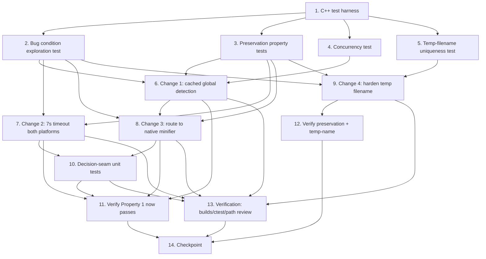

# Implementation Plan

## Overview

This plan follows the exploratory bugfix workflow: establish a C++ test harness, characterize
current behavior, surface the bug, then apply the cross-platform fix (design Changes 1-4) and
validate that the bug is fixed and existing behavior is preserved. The native internal minifier
(`HtmlCompressor::minifyJS(js, scope)`) is the guaranteed fallback and must always produce valid
output. All four behavioral changes are applied to BOTH the `#ifdef _WIN32` and the `#else` (Linux)
branches of `minifyJS.cpp`; each change is a strict improvement (cached detection, no npx, shorter
timeout) that makes the Linux path faster and more robust without breaking its currently-working
behavior.

## Tasks

- [x] 1. Set up the C++ test harness under `testing/`
  - Create `testing/test_framework.hpp`: a single-header, dependency-free assertion harness providing
    `CHECK(cond)`, `CHECK_EQ(a, b)`, a simple test registry (self-registering test cases), and a
    `main()` that runs all registered tests and returns non-zero on any failure (ctest-friendly)
  - Create `testing/CMakeLists.txt` that builds a static lib from the compression sources
    (`src/compression/**`) or reuses the existing source glob, links it with the test translation
    units, and registers each test executable via `add_test` so `ctest` can drive them
  - Wire into the root `CMakeLists.txt` behind an option so the default `compressor` shared-library
    build is unaffected:
    ```
    option(BUILD_TESTING_CPP "Build the C++ compressor tests" OFF)
    if(BUILD_TESTING_CPP)
        enable_testing()
        add_subdirectory(testing)
    endif()
    ```
  - Add a compile-time `PHPSPA_TESTING` seam only if needed to reach the `private`
    `minifyCSS`/`minifyHTML`/`optimizeAttributes` routines (a `friend`-based accessor header or thin
    wrappers under `#ifdef PHPSPA_TESTING`); prefer driving behavior through the public seams
    (`compress`, the two `minifyJS` overloads, `currentLevel`) first
  - Verify a trivial placeholder test configures and runs via `cmake -DBUILD_TESTING_CPP=ON` + `ctest`
  - _Design: Testing Strategy → C++ Test Harness_
  - _Requirements: 3.5 (test infrastructure to protect internal minifier semantics)_

- [x] 2. Write bug condition exploration test (BEFORE implementing the fix)
  - **Property 1: Bug Condition** - Cross-platform graceful degradation (no npx, timeout routed to native minifier)
  - **CRITICAL**: This test MUST FAIL / demonstrate the defect on unfixed code — it confirms the bug exists
  - **DO NOT attempt to fix the test or the code when it fails**
  - **NOTE**: This test encodes the expected behavior and will validate the fix once it passes after implementation
  - **GOAL**: Surface counterexamples that demonstrate the bug on the unfixed decision seam
  - **Scoped PBT Approach**: The core defect is process-orchestration and awkward to reproduce
    deterministically, so scope the property to concrete, in-process decision-seam cases by stubbing/injecting
    around the platform probe/run command under `PHPSPA_TESTING` (Windows: `runCommandHiddenWindows`;
    Linux: the `std::system` probe / `timeout`-prefixed run):
    - Simulate a failing global-detection probe under load → observe unfixed `getBundlerPath` returns
      `"npx --yes esbuild"` (downgrade) instead of avoiding npx, on BOTH platforms (counterexample for
      Req 1.2 / 2.1, 2.2)
    - Simulate an esbuild invocation timing out (Windows `-2`; Linux `timeout` non-zero, typically 124)
      → observe unfixed `runBundler` treats the timeout like any non-zero status with no distinct
      native-minifier route and a 20s budget (counterexample for Req 1.3, 1.4 / 2.3, 2.4)
    - Assert the intended post-fix behavior (from `isBugCondition`): for Windows OR Linux AGGRESSIVE/EXTREME
      under congestion the timeout is 7 seconds (Windows 7000ms; Linux `timeout 7s`), npx is never launched
      on either platform, and timeout/no-bundler routes straight to the native minifier producing valid
      minified output
  - Run test on UNFIXED code
  - **EXPECTED OUTCOME**: Test FAILS (proves the bug: per-call probe → npx downgrade on both platforms, and
    the timeout signal conflated with generic failure at a 20s budget)
  - Document counterexamples found (e.g. "probe failure yields `npx --yes esbuild` on both platforms",
    "timeout not routed to native minifier") to confirm the root-cause hypotheses
  - Mark task complete when the test is written, run, and the failure is documented
  - _Design: Correctness Properties → Property 1; Fix Checking_
  - _Requirements: 2.1, 2.2, 2.3, 2.4_

- [x] 3. Write preservation property tests (BEFORE implementing the fix)
  - **Property 2: Preservation** - Non-buggy inputs unchanged (native minifier, level gating, env override)
  - **IMPORTANT**: Follow the observation-first methodology — run the UNFIXED code, record actual outputs,
    then write property-based tests asserting those observed outputs across the input domain
  - Observe and capture golden output on UNFIXED code, then encode as property/golden tests:
    - `test_minify_js.cpp` — native `minifyJS`: comment stripping, semicolon insertion, spacing,
      string/template-literal/regex handling; scope=global (no wrapping) vs scope=scoped
      (`(()=>{ ... ;})();` IIFE wrapping with trailing `;`/whitespace trimming); EXTREME strips block
      comments while AGGRESSIVE does not (via `currentLevel`)
    - `test_minify_css.cpp` — `minifyCSS` correct minification at/above AGGRESSIVE and no-op below AGGRESSIVE
    - `test_minify_html.cpp` / `test_compress.cpp` — `compress()` pipeline and level gating: BASIC minifies
      HTML only, AGGRESSIVE also removes comments, EXTREME behavior
  - Add property-based coverage: generate varied JS inputs and assert the native minifier preserves
    string/template-literal contents and produces balanced IIFE wrapping for scoped / no wrapping for
    global across random scope/level combinations
  - Run tests on UNFIXED code
  - **EXPECTED OUTCOME**: Tests PASS (this establishes the baseline behavior to preserve)
  - Mark task complete when tests are written, run, and passing on unfixed code
  - _Design: Correctness Properties → Property 2; Preservation Checking_
  - _Requirements: 3.1, 3.4, 3.5_

- [x] 4. Write concurrency / thread-safety test (BEFORE implementing the fix)
  - **Property 2: Preservation** - Concurrent compression is safe with a fixed level
  - Spawn many threads calling `compress()` / native `minifyJS` concurrently on independent input strings
    with a single `currentLevel` set once before launch (no per-thread mutation)
  - Assert no crash and that each thread's output is valid minified output matching its single-threaded result
  - Document the shared static `HtmlCompressor::currentLevel` data-race concern: `currentLevel` is
    process-global mutable state; concurrent *writes* would be a data race, so the test only exercises
    concurrent *reads* with a fixed level. Note that mixing levels across concurrent calls is unsupported
    by the current design (follow-up finding, out of scope for this cross-platform fix)
  - Run on UNFIXED code
  - **EXPECTED OUTCOME**: Tests PASS (baseline concurrent-read safety with a fixed level)
  - _Design: Testing Strategy → C++ Test Harness (`test_concurrency.cpp`); Integration Tests_
  - _Requirements: 2.4, 3.5_

- [x] 5. Write temp-filename uniqueness test (BEFORE implementing the fix)
  - **Property 2: Preservation** - Temp filenames are unique under concurrency
  - Expose `makeTempFilename` to tests via a `PHPSPA_TESTING` seam
  - Spawn many threads calling `makeTempFilename` rapidly and assert all generated names are unique
  - Run on UNFIXED code
  - **EXPECTED OUTCOME**: May collide under coarse `high_resolution_clock` resolution (documents root
    cause 4); if it passes, keep it as a regression guard for the hardening in task 9
  - Document any collisions found
  - _Design: Hypothesized Root Cause 4; Testing Strategy → `test_temp_filename.cpp`_
  - _Requirements: (secondary hardening — supports 2.4 reliability under concurrency)_

- [x] 6. Change 1 — Thread-safe cached global esbuild detection (cross-platform)
  - [x] 6.1 Implement a single cached cross-platform global-esbuild detection helper
    - Add a cross-platform helper in the anonymous namespace of `minifyJS.cpp`:
      `bool isGlobalEsbuildAvailable()` using a thread-safe function-local `static const bool` (Meyers
      static, thread-safe under C++20) whose probe body runs exactly once and is `#ifdef`-guarded:
      Windows → `runCommandHiddenWindows("esbuild --version", 2000) == 0`; Linux →
      `std::system("esbuild --version > /dev/null 2>&1") == 0`. The platform-specific probe internals
      differ but the cached RESULT is shared (or `std::call_once` + `std::atomic<bool>` if explicit
      control is preferred). The cached value is read-only after init, so concurrent reads are safe on
      both platforms
    - In `getBundlerPath` (BOTH branches): keep the `PHPSPA_JS_BUNDLER` env override FIRST and UNCHANGED,
      bypassing detection/cache entirely; then return `"esbuild"` if `isGlobalEsbuildAvailable()` is true,
      else return an empty-string sentinel meaning "no bundler available" (no `npx`) on both platforms
    - _Bug_Condition: isBugCondition(input) — Windows OR Linux, AGGRESSIVE/EXTREME, probe fails under load_
    - _Expected_Behavior: reuse cached global detection; never downgrade to npx on either platform_
    - _Preservation: env override honored and bypasses cache on all platforms_
    - _Requirements: 2.1, 2.2, 3.2_

- [x] 7. Change 2 — esbuild execution timeout 20s → 7s (cross-platform)
  - [x] 7.1 Shorten the bundler-run timeout on both platforms
    - In the `#ifdef _WIN32` branch of `runBundler`, change the bundler-run call from
      `runCommandHiddenWindows(command, 20000)` to `runCommandHiddenWindows(command, 7000)` with a comment
      noting it is a per-esbuild execution timeout, not a whole-request timeout
    - In the `#else` (Linux) branch of `runBundler`, change the command prefix from `timeout 20s ` to
      `timeout 7s ` (the Linux path relies on the coreutils `timeout` command already in use)
    - Leave the `runCommandHiddenWindows` default parameter (`= 20000`) and the detection-probe call
      (`..., 2000`) unchanged; only the bundler-run call sites change
    - _Bug_Condition: isBugCondition(input) — esbuild invocation exceeds timeout under congestion (both platforms)_
    - _Expected_Behavior: 7-second per-esbuild execution budget on Windows AND Linux_
    - _Preservation: probe/default timeouts unchanged; successful esbuild output within budget unchanged_
    - _Requirements: 2.3, 2.6, 3.3_

- [x] 8. Change 3 — Route timeout / no-bundler straight to the native minifier (cross-platform)
  - [x] 8.1 Short-circuit the empty-sentinel no-bundler case in `runBundler`
    - In `runBundler` (BOTH branches), after resolving the bundler via `getBundlerPath`, if it returned the
      empty sentinel: do NOT build or spawn any command, append a distinct debug note ("No bundler
      available; using internal minifier"), clean up the temp input file, and `return false` — no npx on
      either platform
    - _Bug_Condition: isBugCondition(input) — no global esbuild, no env override (Windows or Linux)_
    - _Expected_Behavior: no npx; return false so caller uses native minifier on both platforms_
    - _Preservation: env-override path unaffected on all platforms_
    - _Requirements: 2.2, 2.4_
  - [x] 8.2 Route the timeout signal explicitly in `runBundler`
    - In `runBundler`, when a timeout occurs — Windows `status == -2`; Linux the `timeout 7s` prefix yields
      a non-zero status (typically 124) — record a distinct debug reason ("esbuild timed out after 7s; using
      internal minifier"), clean up temp files (input/output/error), and `return false` on both platforms
    - Confirm the 3-arg `HtmlCompressor::minifyJS` already falls back to the 2-arg native minifier when
      `runBundler` returns `false`; retain this behavior (no change to the BASIC gate). On both platforms,
      `runBundler == false` ⇒ native minifier ⇒ guaranteed valid output, with no npx path attempted after
      a timeout
    - _Bug_Condition: isBugCondition(input) — esbuild invocation times out (Windows -2 / Linux non-zero)_
    - _Expected_Behavior: on timeout, go straight to native minifier; no npx after timeout on either platform_
    - _Preservation: BASIC gate unchanged (Req 3.1); successful esbuild output within budget unchanged (Req 3.3, 3.4)_
    - _Requirements: 2.4, 2.5, 3.1, 3.3, 3.4_

- [ ] 9. Change 4 — Harden `makeTempFilename` uniqueness (cross-platform, non-behavioral)
  - [-] 9.1 Compose temp filenames from clock + thread id + atomic counter
    - Update `makeTempFilename` to combine the high-resolution clock counter (as today), the hashed
      current thread id (`std::hash<std::thread::id>`), and a monotonic `static std::atomic<uint64_t>`
      counter (`fetch_add(1, std::memory_order_relaxed)`)
    - Add `#include <atomic>` and `#include <thread>`
    - Keep this change compression-behavior-neutral (only the temp file naming changes)
    - _Bug_Condition: root cause 4 — temp-name collision under concurrency_
    - _Expected_Behavior: unique temp names across concurrent threads_
    - _Preservation: no change to compression output on any platform_
    - _Requirements: (secondary hardening supporting 2.4 reliability)_

- [~] 10. Add decision-seam unit tests (after fix)
  - `PHPSPA_JS_BUNDLER` honored (both platforms where testable): with the env var set, `getBundlerPath`
    returns it verbatim and bypasses the detection cache (assert via the decision seam)
  - Empty sentinel returned (no npx) on BOTH platforms when no global esbuild is available (stub/inject the
    probe to fail via `PHPSPA_TESTING` around `runCommandHiddenWindows` on Windows and the `std::system`
    probe on Linux)
  - Detection is cached: the probe is invoked at most once across repeated `getBundlerPath` calls on both platforms
  - Timeout routes to the native fallback: stub the run command to signal a timeout (Windows `-2`; Linux
    non-zero) and assert `runBundler` returns `false` with the distinct timeout debug note and no npx command
    constructed on either platform
  - _Design: Unit Tests; Fix Checking_
  - _Requirements: 2.2, 2.3, 2.4, 3.2_

- [~] 11. Verify bug condition exploration test now passes
  - **Property 1: Expected Behavior** - Cross-platform graceful degradation (no npx, 7s timeout, native fallback)
  - **IMPORTANT**: Re-run the SAME test from task 2 — do NOT write a new test
  - The test from task 2 encodes the expected behavior; when it passes it confirms the fix
  - Run the bug condition exploration test from task 2 against the fixed code
  - **EXPECTED OUTCOME**: Test PASSES (7s timeout on both platforms, no npx on Windows or Linux,
    timeout/no-bundler → native minifier, valid output)
  - _Design: Correctness Properties → Property 1_
  - _Requirements: 2.1, 2.2, 2.3, 2.4, 2.5_

- [~] 12. Verify preservation and concurrency tests still pass
  - **Property 2: Preservation** - Non-buggy inputs and concurrency unchanged
  - **IMPORTANT**: Re-run the SAME tests from tasks 3, 4, and 5 — do NOT write new tests
  - Run the preservation golden/property tests (task 3), the concurrency test (task 4), and the
    temp-filename uniqueness test (task 5) against the fixed code
  - **EXPECTED OUTCOME**: Preservation and concurrency tests PASS (no regressions); temp-filename
    uniqueness now passes reliably after the Change 4 hardening
  - _Design: Correctness Properties → Property 2; Preservation Checking_
  - _Requirements: 3.1, 3.2, 3.4, 3.5_

- [~] 13. Verification — builds, ctest, and cross-platform path review
  - Build the default shared `compressor` library and confirm it is unchanged by default (no
    `BUILD_TESTING_CPP` needed): `cmake -B build && cmake --build build`
  - Configure and run the C++ tests: `cmake -B build -DBUILD_TESTING_CPP=ON && cmake --build build && ctest --test-dir build --output-on-failure`
  - Confirm by review that BOTH the `#ifdef _WIN32` and the `#else` (Linux) branches now apply the four
    changes: cached detection, empty sentinel (no npx), 7s execution timeout (Windows 7000 / Linux
    `timeout 7s`), and the hardened temp-name generator
  - Confirm by review + the decision-seam test (task 10) that no code path on either platform spawns `npx`,
    and that a responsive esbuild within 7s still returns esbuild output (Req 2.6, 3.3, 3.4)
  - _Design: Testing Strategy → Integration Tests_
  - _Requirements: 2.2, 2.6, 3.3, 3.4, 3.5_

- [~] 14. Checkpoint - Ensure all tests pass
  - Ensure all tests pass via `ctest`, ask the user if questions arise.

## Task Dependency Graph

The tasks must be executed respecting the following dependencies. Task 1 builds the harness that
every test depends on. The baseline/exploration tests (2-5) run on unfixed code before the fix
(6-9). Within the fix, `getBundlerPath` detection (6) must land before `runBundler` routing (8).
The behavioral changes (7, 8) and the temp-name hardening (9) precede their respective verification
tasks. Task 14 is the final checkpoint gated on everything.

Dependency list:

- Task 1 (harness) → prerequisite for Tasks 2, 3, 4, 5
- Tasks 2, 3, 4, 5 (baseline/exploration tests on unfixed code) → precede Tasks 6, 7, 8, 9 (implementation)
- Task 6 (getBundlerPath sentinel/cached detection, both platforms) → prerequisite for Task 8 (runBundler routing)
- Task 7 (7s timeout, both platforms) → precedes Task 10 (decision-seam tests) and Task 11 (re-run Property 1)
- Task 8 (runBundler routing: sentinel + timeout, both platforms) → precedes Task 10 and Task 11
- Task 9 (temp filename hardening) → precedes Task 12 (temp-name uniqueness re-check)
- Tasks 11, 12, 13 (verification) → depend on Tasks 6, 7, 8, 9, 10
- Task 14 (final checkpoint) → depends on all tasks



Execution waves (tasks within a wave can run in parallel; waves run in order):

```json
{
  "waves": [
    { "wave": 1, "tasks": [1] },
    { "wave": 2, "tasks": [2, 3, 4, 5] },
    { "wave": 3, "tasks": [6, 7, 9] },
    { "wave": 4, "tasks": [8] },
    { "wave": 5, "tasks": [10] },
    { "wave": 6, "tasks": [11, 12, 13] },
    { "wave": 7, "tasks": [14] }
  ]
}
```

## Notes

- **Cross-platform behavioral change**: All fixes (Changes 1-3) alter BOTH the `#ifdef _WIN32` and the
  `#else` (Linux) paths in `minifyJS.cpp`. Change 4 (temp-filename hardening) is cross-platform and
  compression-behavior-neutral.
- **Linux path now also improved**: The `#else` branch is no longer preserved as-is — it now also gets the
  four improvements. `getBundlerPath` caches detection and returns the empty sentinel (no `npx --yes esbuild`
  fallback), and the `timeout 20s` prefix in `runBundler` becomes `timeout 7s`. Each is a strict improvement
  that keeps the currently-working Linux behavior intact for successful esbuild runs within budget.
- **Native minifier is the guaranteed fallback**: `HtmlCompressor::minifyJS(js, scope)` always produces
  valid minified output. On both platforms, any timeout (Windows `-2` / Linux non-zero) or no-bundler-available
  condition routes straight to it, and no `npx` path is ever attempted.
- **Genuinely unchanged behavior**: BASIC level uses the internal minifier only (Req 3.1); the
  `PHPSPA_JS_BUNDLER` env override is honored and bypasses the cache (Req 3.2); a successful esbuild run
  within budget still returns esbuild output (Req 3.3, 3.4); and the internal minifier's tokenization/IIFE
  semantics are unchanged (Req 3.5) — all on both platforms.
- **Building and running the C++ tests**: Configure with `-DBUILD_TESTING_CPP=ON` (default OFF, so the
  standard `compressor` shared-library build is unaffected) and run the suite with `ctest`, e.g.
  `cmake -B build -DBUILD_TESTING_CPP=ON && cmake --build build && ctest --test-dir build --output-on-failure`.
