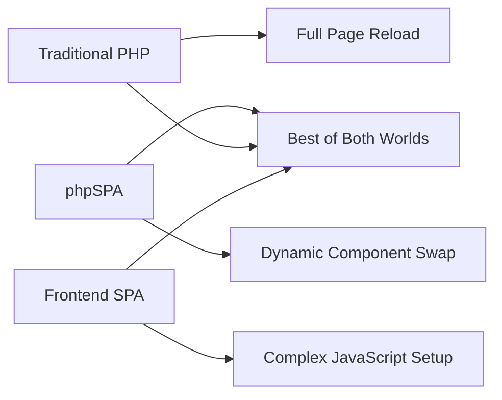
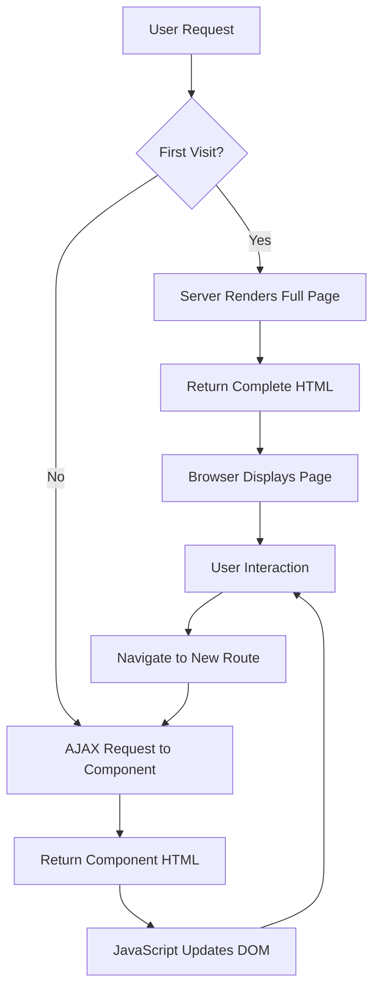

# 📘 phpSPA Documentation

## 🏠 Introduction

Welcome to **phpSPA**, a lightweight PHP framework for building dynamic, component-based single-page applications (SPAs) — **without leaving PHP or relying on heavy frontend frameworks**.

!!! success "The PHP Way to Build SPAs"
    phpSPA brings the modern SPA experience (like React or Vue) to standard PHP by **dynamically swapping page content** using custom PHP components, while keeping your existing HTML and PHP workflow.

---

## 🚀 What is phpSPA?

phpSPA is a **pure PHP library** that transforms how you build web applications:

### Core Capabilities

=== "Component System"
    * Write components as standard PHP functions that return HTML

    * Organize your code in reusable, maintainable pieces

    * Pass data between components seamlessly

=== "Smart Routing"
    * Define routes and HTTP methods tied to components

    * Handle GET, POST, and other HTTP methods

    * Support for dynamic parameters and patterns

=== "Dynamic Updates"
    * Update specific sections without full page reloads

    * Maintain browser history and URL integrity
  
    * Preserve SEO with server-side rendering

=== "Developer Experience"
    * No build tools or compilation steps required
  
    * Works with your existing PHP knowledge
  
    * Graceful fallback when JavaScript is disabled

---

## 🧠 Why Choose phpSPA?

If you're a PHP developer who wants modern web app features without the complexity, phpSPA is your solution:

!!! question "Are You Tired Of..."
    * **Full page reloads** slowing down your app?

    * **Learning complex JavaScript frameworks** just for dynamic UI?
  
    * **Managing separate frontend and backend** codebases?

    * **Complex build processes** and toolchain setup?

!!! check "phpSPA Solves This!"
    * ✅ A modern, dynamic user experience (like SPAs)
  
    * ✅ No full page reloads on navigation
  
    * ✅ Stay within the comfort of PHP
  
    * ✅ No complex build tools, no virtual DOMs
  
    * ✅ Component-based structure like React — but in PHP

### Comparison with Other Solutions

| Feature              | Traditional PHP | phpSPA       | React/Vue      |
| -------------------- | --------------- | ------------ | -------------- |
| **Learning Curve**   | Easy            | Easy         | Steep          |
| **Page Reloads**     | Full reload     | Dynamic swap | Dynamic swap   |
| **SEO Ready**        | ✅ Yes           | ✅ Yes        | ⚠️ Requires SSR |
| **Build Process**    | None            | None         | Complex        |
| **Language**         | PHP only        | PHP only     | JS + PHP API   |
| **Component System** | ❌ No            | ✅ Yes        | ✅ Yes          |

---

## 🛠 Key Features

### Architecture Benefits

!!! tip "Component-Based Design"
    Structure your application with reusable PHP components that encapsulate logic and presentation together.

!!! info "Dynamic Content Swapping"
    Update only the parts of your page that need to change, with full browser history support.

!!! note "Server-Side Rendering"
    Initial page load is fully rendered on the server for optimal SEO and performance.

### Technical Features

- **🔄 Route Handling** - Support for multiple HTTP methods (`GET`, `POST`, `PUT`, `DELETE`)
- **🎯 Target Areas** - Specify exactly which DOM element to update
- **⚡ Loading States** - Global and per-component loading indicators
- **🔗 Navigation** - Programmatic and declarative navigation options
- **🧠 State Management** - Built-in state system for reactive components
- **🛡️ CSRF Protection** - Security features built-in
- **📱 Mobile Ready** - Responsive and touch-friendly

---

## 🎯 Who Should Use phpSPA?

### Perfect For

!!! success "Ideal Use Cases"
    - **PHP developers** who want SPA features without learning new languages
    - **Small to medium projects** that need dynamic interfaces
    - **SEO-critical applications** that can't sacrifice server-side rendering
    - **Teams** that want to maintain a single codebase
    - **Projects** with existing PHP infrastructure

### Not Recommended For

!!! warning "Consider Alternatives If..."
    - You need complex client-side state management
    - Your team is already invested in React/Vue ecosystem
    - You're building a mobile app (use React Native/Flutter instead)
    - You need real-time features like live chat (consider WebSockets)

---

## 🏗️ Architecture Overview

Understanding how phpSPA works will help you build better applications:

### Key Concepts

- **Layout**: The base HTML template with placeholders
- **Components**: PHP functions that return HTML content
- **Router**: Matches URLs to components and handles requests
- **Client Engine**: Small JavaScript library for DOM updates

---

## 👇 Next Steps

Ready to start building? Here's your learning path:

!!! tip "Follow This Order"
    1. **[Getting Started](2-getting-started.md)** - Set up your first phpSPA project
    2. **[Creating Components](3-creating-your-first-component.md)** - Build your first component
    3. **[Routing & Parameters](4-routing-and-parameters.md)** - Handle URLs and data
    4. **[State Management](17-state-management.md)** - Add interactivity

---

## 💡 Need Help?

- 📖 **Documentation**: You're reading it!
- 🐛 **Issues**: [GitHub Issues](https://github.com/dconco/phpspa/issues)
- 💬 **Discussions**: [GitHub Discussions](https://github.com/dconco/phpspa/discussions)
- ⭐ **Star us**: [GitHub Repository](https://github.com/dconco/phpspa)

Let's build something amazing with phpSPA! 🚀
