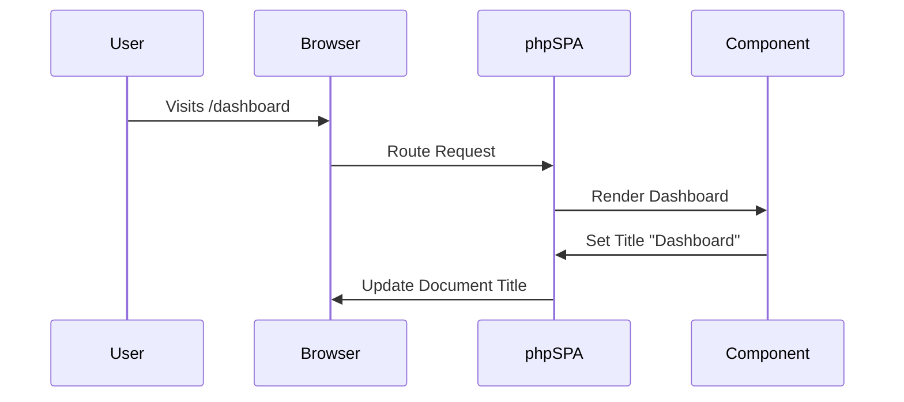

# 🏷️ Setting Page Titles

!!! abstract "Dynamic Title Management"
    phpSPA components control their own page titles, enabling dynamic updates without hardcoded layouts.

---

## 🔧 Implementation

### Basic Title Setting

```php title="Static title example"
<?php
$profile = new Component('UserProfile');
$profile->route("/profile");
$profile->title("My Profile - phpSPA");
```

### Dynamic Titles

```php title="Data-driven titles"
<?php
$dashboard = new Component('Dashboard');

$dashboard->title(function($request) {
    $user = fetchUser($request);
    return "Welcome, {$user->name} | Dashboard";
});
```

!!! tip "Best Practices"
    - Set titles **before rendering**
    - Include site/app name for branding
    - Keep under 60 characters for SEO

---

## 🌟 Key Benefits

| Feature                   | Advantage                          |
| ------------------------- | ---------------------------------- |
| **Per-Component Control** | Each page manages its own title    |
| **Dynamic Updates**       | Supports data injection            |
| **SEO Friendly**          | Properly indexed by search engines |
| **Client-Side Sync**      | Works during SPA navigation        |



---

## 🚀 Advanced Patterns

### Title Templates

```php title="Consistent formatting"
<?php
function setTitle($base) {
    return "$base | My Awesome App";
}

$about->title(setTitle("About Us"));
```

---

## ⚠️ Common Pitfalls

1. **Missing Titles**  
   Always set a default in your layout
2. **Duplicate Branding**  
   Avoid "App Name | Page | App Name"
3. **Dynamic Failures**  
   Sanitize user input in titles

```php title="Safe dynamic example"
<?php $title = htmlspecialchars($userInput) . " - phpSPA"; ?>
```

---

➡️ **Next Up**: [Handling Error Routes (404 Pages) :material-arrow-right:](./14-handling-error-routes.md){ .md-button .md-button--primary }
