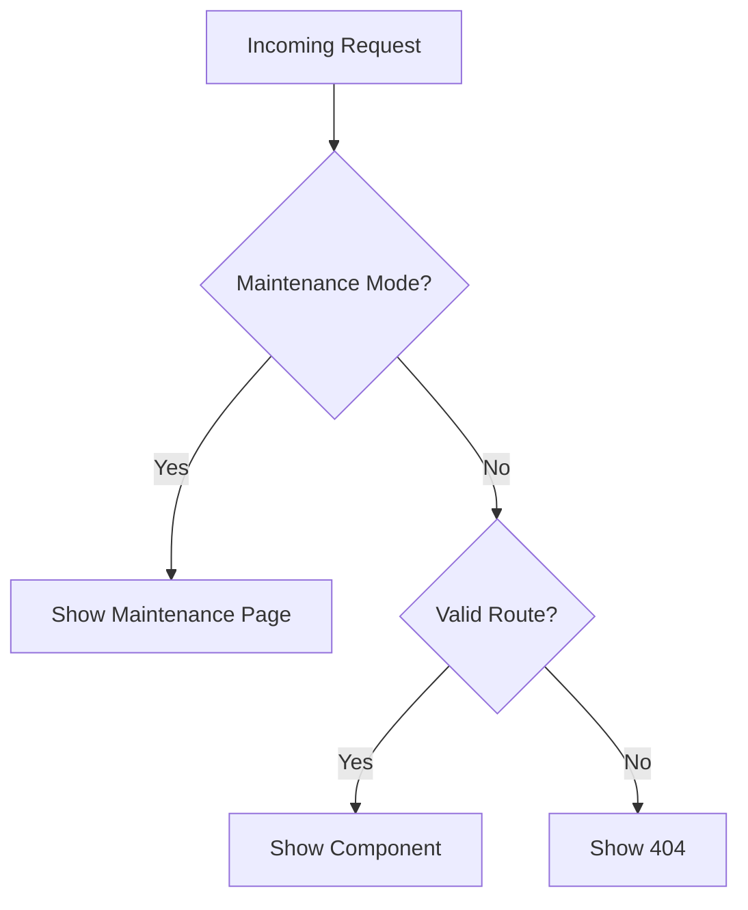

# 🚨 Handling Error Routes

!!! fail "Route Fallback System"
    phpSPA uses wildcard routing (`*`) to gracefully handle missing or unauthorized pages with native 404/403 support.

---

## 404 - Page Not Found

### 🛠️ Implementation

```php title="Wildcard fallback route"
<?php
$notFound = new Component('NotFound');

$notFound->route("pattern: *");  // Catch-all route
$notFound->title("404 - Not Found");
```

```php title="Example 404 Component"
<?php
function NotFound() {
    return <<<HTML
        <div class="error-page">
            <h1>🚧 404</h1>
            <p>This page doesn't exist</p>
            <Link to="/" label="Return Home" />
        </div>
    HTML;
}
```

!!! note "Routing Order"
    The wildcard route should be registered **last** to only catch unmatched paths.

---

## 403 - Access Denied

### 🔐 Two Implementation Strategies

#### 1. Component-Level Guard (Recommended)

```php title="Inline permission check"
<?php
function AdminDashboard($request = new Request()) {
    if (!userCanAccess($request)) {
        return ForbiddenComponent();  // Rendered immediately
    }
    return /* admin content */;
}
```

#### 2. Dedicated Route

```php title="Explicit 403 route"
<?php
$forbidden = new Component('Forbidden');

$forbidden->route("/forbidden");
$forbidden->title("Access Denied");

// Redirect trigger:
function SecureArea() {
    if (!isAuthorized()) {
        return Navigate::to('/forbidden');
    }
}
```

---

## 🚧 Maintenance Mode

### Global Override Pattern

```php title="Emergency maintenance"
<?php
if ($systemUnderMaintenance) {
    $maintenance = new Component('MaintenanceView');
    $maintenance->route("pattern: *");  // Overrides ALL routes
    $maintenance->title("Down for Maintenance");
}
```



---

## 🧩 Advanced Patterns

### Dynamic Error Handling

```php title="Context-aware errors"
<?php
function ErrorHandler($type = 404) {
    return match($type) {
        403 => ForbiddenPage(),
        404 => NotFoundPage(),
        500 => ServerErrorPage(),
        default => GenericError()
    };
}
```

### Logging Integration

```php title="Error tracking"
<?php
$notFound->onRender(function() {
    logError("404 hit: " . currentPath());
});
```

### Custom Error Props

```php title="Enhanced 404"
<?php
function NotFound($path = []) {
    $requested = $path[0] ?? 'unknown';
    return "No page found for '$requested'";
}
```

---

## ⚠️ Common Pitfalls

1. **Route Priority**  
   Wildcards should be registered after specific routes
2. **SEO Considerations**  
   Ensure error pages return proper HTTP status codes
3. **Overriding Intentionally**  
   Remember maintenance mode affects all routes

```php title="Safe maintenance check"
if ($maintenanceMode && !isAdmin()) {
    // Show maintenance page
}
```

---

➡️ **Next Up**: [Javascript Navigation :material-arrow-right:](./15-javascript-navigation.md){ .md-button .md-button--primary }
