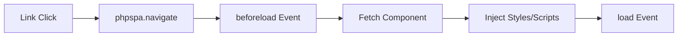

# 🧭 JavaScript Navigation

!!! abstract "Client-Side Routing"
    phpSPA provides seamless page transitions through its JavaScript API, including history management, event hooks, and dynamic component loading.

---

## 🚀 Quick Start

```html title="Include the runtime"
<!-- Before closing </body> -->
<script src="https://cdn.jsdelivr.net/npm/phpspa-js"></script>
```

```javascript title="Basic navigation"
// Navigate to dashboard (adds to history)
phpspa.navigate("/dashboard");

// Replace current history entry
phpspa.navigate("/login", "replace");
```

---

## 📌 Core API

### Navigation Methods

| Method                 | Description            | Example                       |
| ---------------------- | ---------------------- | ----------------------------- |
| `navigate(path, mode)` | Main navigation method | `phpspa.navigate("/profile")` |
| `back()`               | History backward       | `phpspa.back()`               |
| `forward()`            | History forward        | `phpspa.forward()`            |
| `reload()`             | Refresh current view   | `phpspa.reload()`             |

### History Modes

```javascript
"push"    // Default - adds to history stack (Ctrl+Z-able)
"replace" // Replaces current entry (no back navigation)
```

---

## 🔗 The `<Link>` Component

```html title="SPA-enabled links"
<Link to="/about" children="About Us" class="nav-link" />
```

**Rendered As:**

```html
<a href="/about" class="nav-link" data-type="phpspa-link-tag">About Us</a>
```

!!! tip "Automatic Interception"
    All `<Link>` clicks are handled by phpSPA without page reloads.

---

## 🎛 Event System

```javascript title="Lifecycle Hooks"
// Before route load
phpspa.on("beforeload", ({ route }) => {
  NProgress.start(); // Show loading bar
});

// After successful load
phpspa.on("load", ({ route, success, error }) => {
  if (success) {
    NProgress.done();
    ga('send', 'pageview', route);
  } else {
    // Handle Error
    showToast(`Navigation failed: ${error.message}`);
  }
});
```

**Event Types:**

| Event        | Trigger Timing                |
| ------------ | ----------------------------- |
| `beforeload` | Route change initiated        |
| `load`       | Component loaded successfully |

---

## 🧩 Component Assets

### Scoped Styles

```html title="Component CSS"
<style data-type="phpspa/css">
  .profile-card {
    background: var(--surface);
  }
</style>
```

### Mount Scripts

```html title="Component JS"
<script data-type="phpspa/script">
  document.querySelector('.btn').addEventListener(...);
</script>
```



---

## 🛠 Practical Patterns

### Protected Routes

```javascript
phpspa.on("beforeload", ({ route }) => {
  if (route.startsWith("/admin") && !isAdmin()) {
    phpspa.navigate("/login");
    return false; // Cancel original navigation
  }
});
```

### Analytics Tracking

```javascript
phpspa.on("load", ({ route }) => {
  if (window.ga) ga('send', 'pageview', route);
});
```

### Smooth Transitions

```css
[data-type="phpspa-link-tag"] {
  transition: opacity 0.3s;
}
[data-type="phpspa-link-tag"]:hover {
  opacity: 0.8;
}
```

---

## ⚠️ Common Issues

1. **Missing Script**  
   Ensure `phpspa.js` is loaded before any navigation calls

2. **Event Listener Leaks**  
   Use component scripts for DOM events instead of global handlers

3. **History Loops**  
   Avoid circular redirects in navigation hooks

```javascript title="Safe redirect example"
phpspa.on("beforeload", ({ route }) => {
  if (needsAuth(route) && !isLoggedIn()) {
    phpspa.navigate("/login?return=" + encodeURIComponent(route));
    return false;
  }
});
```

---

➡️ **Next Up**: [State Management :material-arrow-right:](./17-state-management.md){ .md-button .md-button--primary }
