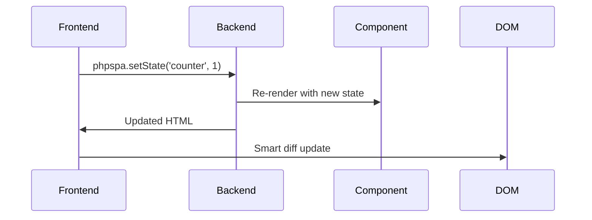
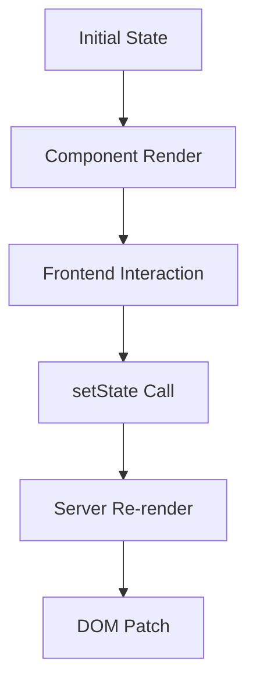

# 🧠 State Management

!!! abstract "Reactive Data Flow"
    phpSPA enables **bidirectional state synchronization** between PHP and JavaScript without full page reloads, using a simple `createState`/`setState` API.

---

## 🚀 Quick Start

```php title="Basic Counter Component"
<?php
use function phpSPA\Component\createState;

function Counter() {
    $count = createState('counter', 0); // Key + initial value
    
    return <<<HTML
        <div>
            <h2>Count: {$count}</h2>
            <button onclick="phpspa.setState('counter', {$count} + 1)">
                Increment
            </button>
        </div>
    HTML;
}
```



---

## 📌 Core Concepts

### State Creation

```php
<?php
$user = createState('auth.user', null); // Global key
$theme = createState('ui.theme', 'dark'); // Namespaced key
```

### State Access

| Context   | Syntax              | Example                                |
| --------- | ------------------- | -------------------------------------- |
| PHP Read  | `$state()`          | `$current = $user()`                   |
| PHP Write | `$state(newValue)`  | `$user(['id' => 42])`                  |
| JS Update | `phpspa.setState()` | `phpspa.setState('ui.theme', 'light')` |

---

## 🛠 Advanced Patterns

### State Initialization

```php title="Bootstrapping from backend"
<?php
$initialData = fetchFromDatabase();
$data = createState('app.data', $initialData);
```

### State Validation

```php title="Type-safe state"
<?php
$quantity = createState('cart.quantity', 1);
if (is_numeric($_POST['qty'])) {
    $quantity((int)$_POST['qty']); // Only accept integers
}
```

### Derived State

```php title="Computed values"
<?php
$items = createState('cart.items', []);
$total = count($items()); // Reactively updates
```

---

## 🔄 Lifecycle Flow

1. **Initial Render**  
   PHP creates state with default values
2. **Frontend Update**  
   JavaScript calls `phpspa.setState(key, value)`
3. **Server Reconciliation**  
   phpSPA re-renders component with new state
4. **DOM Update**  
   Only changed portions update via morphdom



---

## ⚠️ Common Pitfalls

1. **Key Collisions**  
   Use namespaced keys (`module.value`) for shared state
2. **Async States**  
   `setState` returns a Promise - use `.then()` for post-update logic
3. **Missing Imports**  
   Ensure proper Composer setup or manual includes

```php title="Manual include (non-Composer)"
<?php
include_once __DIR__.'/phpspa/core/Component/createState.php';
use function phpSPA\Component\createState;
```

---

## 🧪 Real-World Example

```php title="Shopping Cart"
<?php
function Cart() {
    $items = createState('cart.items', []);
    $total = array_sum(array_column($items(), 'price'));

    return <<<HTML
        <div class="cart">
            <h3>Cart Total: \${$total}</h3>
            <ul>
                {$items()->map(fn($i) => "<li>{$i['name']}</li>")}
            </ul>
            <button onclick="addItem()">Add Sample</button>
        </div>

        <script data-type="phpspa/script">
            function addItem() {
                phpspa.setState('cart.items', [
                    ...{$items()},
                    {name: 'Sample', price: 9.99}
                ]);
            }
        </script>
    HTML;
}
```

---

➡️ **Next Up**: [Per-Component Scripts and Styles :material-arrow-right:](./18-component-script-and-styles.md){ .md-button .md-button--primary }
