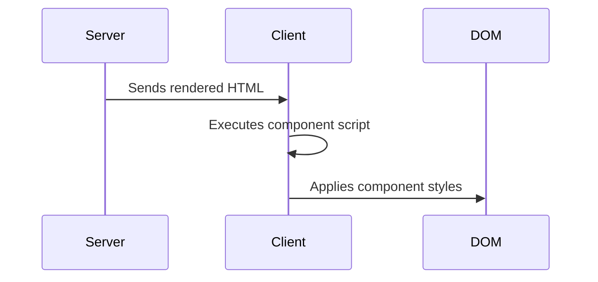

Got it! Let me correct the documentation to accurately reflect how phpSPA's component scripts and styles work:

```markdown
# 🎯 Per-Component Scripts and Styles in PHP

!!! info "Component-Specific Assets"
    phpSPA allows you to define JavaScript and CSS that executes **only when the component renders**, with automatic scoping to prevent global conflicts.

---

## 🚀 Basic Usage

```php title="Adding scripts and styles"
$component = new Component("Example");
$component->script(fn() => <<<JS
    // This runs every time component renders
    console.log("Component rendered at: " + new Date().toLocaleTimeString());
JS);

$component->styleSheet(fn() => <<<CSS
    /* Scoped to this component only */
    .component-header { 
        color: var(--primary);
    }
CSS);
```

---

## 🔍 How It Works

1. **On Render**:
   - PHP processes the component
   - Scripts/styles are collected and injected into the output
2. **On Client**:
   - Scripts execute **once** after component HTML loads
   - Styles apply only to the current component



---

## 📌 Key Characteristics

- **Scripts**:
  - Run after component HTML is inserted
  - Don't return values
  - Execute on every render
  - Scoped to component's lifetime

- **Styles**:
  - Automatically scoped to component
  - Don't persist after navigation
  - Can be overridden by global styles

---

## 🛠 Practical Example

```php title="Form Component"
$form = new Component("ContactForm");
$form->styleSheet(fn() => <<<CSS
    .form-input {
        border: 2px solid #eee;
        padding: 8px;
    }
CSS);

$form->script(fn() => <<<JS
    document.querySelector('.form-input').addEventListener('focus', () => {
        this.style.borderColor = 'blue';
    });
JS);
```

---

## ⚠️ Important Notes

1. Scripts **don't**:
   - Have mount/unmount callbacks
   - Automatically clean up event listeners
   - Return values

2. For cleanup, manually remove listeners:

```php
<?php
$component->script(fn() => <<<JS
    const input = document.querySelector('.form-input');
    const handler = () => console.log('Focused');
    input.addEventListener('focus', handler);
JS);
```

---

➡️ **Next Up**: [Handling Loading States :material-arrow-right:](./19-handling-loading-states.md){ .md-button .md-button--primary }
