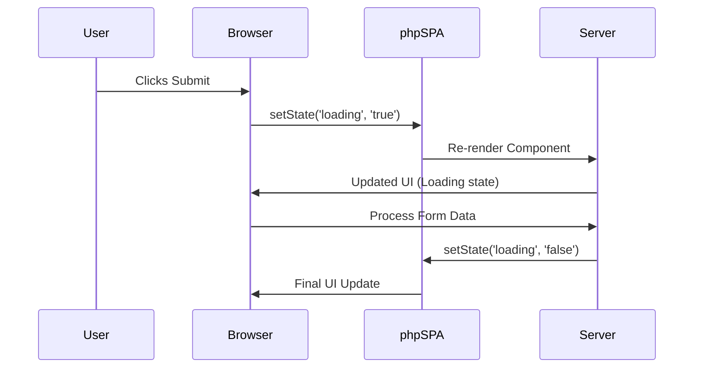

# 🌀 Handling Loading States in phpSPA

!!! abstract "Reactive Loading Indicators"
    Use `createState()` to manage loading states that automatically update your UI during asynchronous operations like form submissions.

---

## 🛠️ Implementation Guide

### 1. Create Loading State

```php title="Define loading state"
<?php
use function phpSPA\Component\createState;

$loading = createState('loading', 'false'); // 'true' or 'false' string
```

### 2. Optional: Form State Management

```php title="Form data state example"
<?php
$formData = createState('login', [
   'username' => '',
   'password' => ''
]);
```

---

## 💡 UI Integration

### Dynamic Button Component

```php title="Conditional button rendering"
<?php
$buttonProps = "$loading" === "true" 
    ? ['text' => 'Loading...', 'disabled' => 'disabled']
    : ['text' => 'LOGIN', 'disabled' => ''];

return <<<HTML
    <button id="submit" {$buttonProps['disabled']}>
        {$buttonProps['text']}
    </button>
HTML;
```

---

## 🧩 Complete Example

```php title="Login Form with Loading State"
<?php
function LoginForm() {
    $loading = createState('loading', 'false');
    
    return <<<HTML
        <form id="login-form">
            <input type="text" id="username" placeholder="Username">
            <input type="password" id="password" placeholder="Password">

            <button id="submit" {$buttonProps['disabled']}>
               {$buttonProps['text']}
            </button>
        </form>

        <script data-type="phpspa/script">
            document.getElementById('login-form').addEventListener('submit', async (e) => {
                e.preventDefault();
                
                await phpspa.setState('loading', 'true');
                
                // Simulate API call
                await new Promise(r => setTimeout(r, 1000));
                
                await phpspa.setState('loading', 'false');
                phpspa.navigate('/dashboard');
            });
        </script>
    HTML;
}
```



---

## 📌 Key Features

| Feature               | Benefit                      |
| --------------------- | ---------------------------- |
| **String States**     | Simple 'true'/'false' values |
| **Automatic UI Sync** | No manual DOM updates        |
| **Promise Chain**     | Sequential state management  |
| **Component Scoped**  | Isolated to current view     |

---

## ⚠️ Common Pitfalls

1. **State Type Confusion**  
   Remember loading state uses strings (`'true'`/`'false'`) not booleans
2. **Missing Cleanup**  
   Always ensure loading gets set to `'false'` after operations
3. **Over-nesting**  
   Avoid deeply nested state conditions

```php title="Safe state handling"
<?php
$loading = createState('loading', 'false');

try {
    await phpspa.setState('loading', 'true');
    // Perform operation
} finally {
    await phpspa.setState('loading', 'false');
}
```

---

➡️ **Next Up**: [Request Handling :material-arrow-right:](./20-request-handling.md){ .md-button .md-button--primary }
