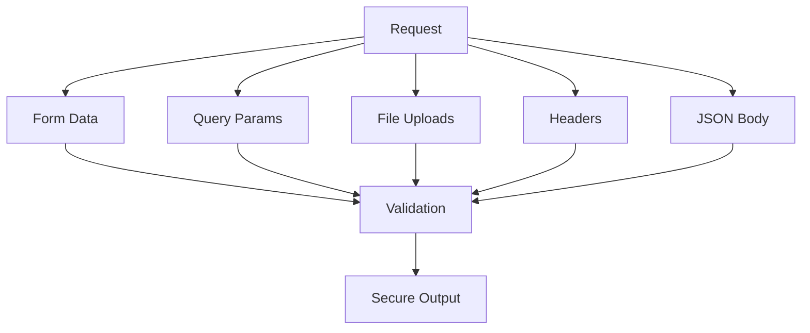

# 📬 Request Handling in phpSPA

!!! abstract "Unified Input Access"
    phpSPA's `Request` object provides secure, consistent access to all input sources - forms, queries, files, and headers - through a simple interface.

---

## 🚀 Quick Start

```php title="Basic Request Usage"
<?php
function ContactForm($path = [], $request = new Request()) {
    $name = $request("name"); // Gets from $_POST or $_GET
    $email = $request("email", "default@example.com"); // With fallback
    
    return "Hello $name ($email)";
}
```

---

## 🔍 Core Features

### 📥 Input Parameters

```php title="Accessing form/query data"
// Optional with default
$page = $request("page", 1);;
```

### 📁 File Uploads

```php title="Handling uploads"
<?php
$avatar = $request->files("avatar");

if ($avatar && $avatar["error"] === UPLOAD_ERR_OK) {
    move_uploaded_file($avatar["tmp_name"], "uploads/" .  $avatar["name"]);
}
```

### 🔐 Authentication

```php title="Auth header handling"
<?php
$auth = $request->auth();

// Basic Auth
$username = $auth->basic["username"];

// Bearer Token
$token = $auth->bearer;
```

---

## 🛠 Advanced Usage

### 🔎 API Development

```php title="API endpoint example"
<?php
function ApiHandler($path, $request) {
    // Verify API key
    if (!$request->apiKey("X-API-Key")) {
        return json_response(["error" => "Unauthorized"], 401);
    }
    
    // Get JSON payload
    $data = $request->json();
    
    return process_data($data);
}
```

### 🔗 Query Parameters

```php title="URL query parsing"
<?php
// /search?q=term&page=2
$search = $request->urlQuery("q");
$page = $request->urlQuery("page") ?? 1;
```

### 📦 JSON Payloads

```php title="JSON request bodies"
$data = $request->json();
$userId = $data["user"]["id"] ?? null;
```

---

## ⚠️ Security Notes

!!! danger "CSRF Protection"
    ```php
    // Coming in v1.2
    // $token = $request->csrfToken();
    // $request->validateCsrf($token);
    ```

!!! success "Automatic Input Validation"
    ```php
    // All inputs are pre-validated by phpSPA
    $username = $request("username"); // Already sanitized
    $email = $request("email"); // Safe for database use
    ```

    phpSPA automatically:
    - Filters all incoming data
    - Converts to appropriate types
    - Handles special characters safely

---

## 📋 Request Methods Cheat Sheet

| Method             | Description         | Example                 |
| ------------------ | ------------------- | ----------------------- |
| `$request(key)`    | Get input parameter | `$request("email")`     |
| `->files(name)`    | File upload         | `->files("avatar")`     |
| `->json()`         | JSON payload        | `->json()["user"]`      |
| `->auth()`         | Auth headers        | `->auth()->bearer`      |
| `->apiKey(header)` | API key check       | `->apiKey("X-API-Key")` |



---

➡️ **Next Up**: [Final Notes :material-arrow-right:](./final-notes.md){ .md-button .md-button--primary }
