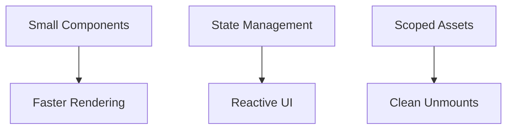

# ✅ Final Notes & Cheat Sheet

!!! abstract "phpSPA at a Glance"
    You're now equipped to build modern PHP applications with phpSPA's component-based architecture and client-side navigation.

---

## 🧩 Core Concepts Recap

```php title="Application Bootstrap"
<?php
$app = new App('layout_function');
$app->defaultTargetID(); // Uses '__CONTENT__' as default
```

```php title="Component Configuration"
<?php
$component->route("/path")        // Route binding
          ->targetID("container") // DOM target
          ->method("GET|POST")    // HTTP method
          ->title("Page Title")   // Document title
          ->meta("description", "My page"); // Meta tags
```

---

## 🛠️ Essential Patterns

### 🔗 Routing

```php
<?php
// Dynamic routes
$component->route("/user/{id}"); 

// Wildcard routes
$component->route("/admin/*");
```

### 🔄 State Management

```php
<?php
$counter = createState('count', 0);
phpspa.setState('count', $counter() + 1); // JS
```

### 🎨 Component Assets

```php
<?php
$component->script(fn() => <<<JS
    // Component-specific JS
JS);

$component->styleSheet(fn() => <<<CSS
    /* Scoped CSS */
CSS);
```

---

## 🛡️ Security Status

!!! warning "Current Limitations"
    ```php
    // Coming in v1.2
    // $request->validateCsrf();
    // $app->enableCsrfProtection();
    ```

!!! success "Built-in Protections"
    - Automatic input validation
    - Route parameter sanitization
    - Safe component isolation

---

## ⚡ Performance Tips

| Do                                    | Don't                         |
| ------------------------------------- | ----------------------------- |
| Use small components                  | Create monolithic components  |
| Leverage state                        | Use global variables          |
| Add per-component assets              | Load all JS/CSS globally      |
| Use case-sensitive routes when needed | Ignore URL casing consistency |



---

## 📚 Resources

```markdown
- [GitHub Repository](https://github.com/dconco/phpspa)
- `composer require dconco/phpspa`
- [Issue Tracker](https://github.com/dconco/phpspa/issues)
```

!!! question "Need Help?"
    Join our [Discussions](https://github.com/dconco/phpspa/discussions) for support and ideas.

---

## 🚀 Recommended Next Steps

1. Build a CRUD interface with state management
2. Create a multi-step form with route transitions
3. Implement authentication flow
4. Develop a reusable component library

➡️ [Starter Templates](https://github.com/dconco/phpspa-template){ .md-button .md-button--primary }
