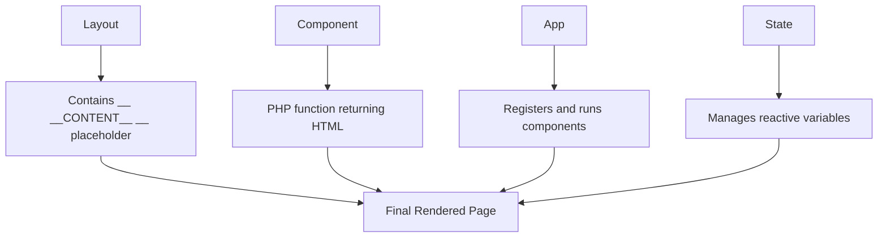

# 📦 phpSPA - Build Native PHP SPAs Without JavaScript Frameworks

**phpSPA** lets you build fast, interactive single-page apps using **pure PHP** — with dynamic routing, component architecture, and no full-page reloads. No JavaScript frameworks required.


[](https://packagist.org/packages/dconco/phpspa)
[](https://packagist.org/packages/dconco/phpspa)
[](https://phpspa.readthedocs.io)
[](https://github.com/dconco/phpspa)

---

## 🎯 Our Goal

To empower PHP developers to create **modern, dynamic web apps** with the elegance of frontend SPA frameworks — but fully in PHP.

!!! success "What Makes phpSPA Special"
    * 🚫 No full-page reloads

    * ⚡ Instant component swapping

    * 🧱 Clean, function-based components

    * 🌍 Real SPA behavior via History API

    * 🧠 Built-in **State Management**

---

## ✨ Key Features

=== "Core Features"
    * 🔄 **Dynamic Updates** - Feels like React, but it's PHP

    * 🧩 **Component Architecture** - Organize your code cleanly

    * 🔗 **URL Routing** - Client and server perfectly synced

    * 🧠 **State Management** - Reactive variables across requests

    * ⚙️ **Lifecycle Support** - Loaders, metadata, and more

    * 🪶 **Minimal JS** - Just one small file

=== "Developer Experience"
    * ✅ Fully PHP + HTML syntax

    * ✅ No template engines required

    * ✅ Dynamic GET & POST routing

    * ✅ Server-rendered SEO-ready output

    * ✅ Per-component and global loading indicators

    * ✅ Supports Composer or manual usage

    * ✅ Graceful fallback (works without JavaScript)

---

## 🧠 How It Works

phpSPA follows a simple but powerful concept:



- **Layout** → The base HTML template with `__CONTENT__`
- **Component** → A PHP function returning HTML
- **App** → Registers and runs components based on routes
- **State** → Simple mechanism for reactive variables

---

## 🚀 Quick Start Example

Here's a complete working example with a live counter:

### 1. Create the Layout

```php title="layout.php"
<?php
function layout() {
    return <<<HTML
    <html>
        <head>
            <title>My Live App</title>
        </head>
        <body>
            <div id="app">__CONTENT__</div>
            <script src="https://cdn.jsdelivr.net/npm/phpspa-js"></script>
        </body>
    </html>
    HTML;
}
```

### 2. Define Components

```php title="components.php"
<?php
function HomePage() {
    $counter = createState("count", 0);

    return <<<HTML
        <h1>Counter: {$counter}</h1>
        <button onclick="phpspa.setState('count', {$counter} + 1)">Increase</button>
        <button onclick="phpspa.setState('count', 0)">Reset</button>
        <br><br>
        <Link to="/login" label="Go to Login" />
    HTML;
}

function LoginPage() {
    return <<<HTML
        <h2>Login</h2>
        <form method="post">
            <input name="username" placeholder="Username"><br>
            <input name="password" type="password" placeholder="Password"><br>
            <button type="submit">Login</button>
        </form>
    HTML;
}
```

### 3. Wire Everything Together

```php title="index.php"
<?php
require 'layout.php';
require 'components.php';

$app = new App('layout');
$app->targetId('app');

$app->attach(
    (new Component('HomePage'))
        ->title('Home')
        ->method('GET')
        ->route('/')
);

$app->attach(
    (new Component('LoginPage'))
        ->title('Login')
        ->method('GET|POST')
        ->route('/login')
);

$app->run();
```

!!! tip "That's It!"
    You now have a fully functional SPA with state management, routing, and dynamic updates — all in pure PHP!

---

## 🧠 State Management Made Simple

Create reactive state variables in your components:

```php
$counter = createState("counter", 0);
```

Update from the frontend:

```javascript
phpspa.setState("counter", newValue);
```

The component automatically **re-renders** when state changes! 🎉

---

## 📦 Installation Options

=== "Composer (Recommended)"

    ```bash
    composer require dconco/phpspa
    ```

    Then include the autoloader:

    ```php
    <?php
    require 'vendor/autoload.php';

    use phpSPA\App;
    use phpSPA\Component;
    ```

=== "Manual Installation"

    Download and include the core files:

    ```bash
    git clone https://github.com/dconco/phpspa.git
    ```

    ```php
    <?php
    require 'path/to/phpspa/core/App.php';
    require 'path/to/phpspa/core/Component.php';
    
    use phpSPA\App;
    use phpSPA\Component;
    ```

=== "CDN (JavaScript)"

    Add the client-side engine:

    ```html
    <script src="https://cdn.jsdelivr.net/npm/phpspa-js"></script>
    ```

---

## 🛠 Advanced Features

### JavaScript Events

```javascript
phpspa.on("beforeload", ({ route }) => showLoader());
phpspa.on("load", ({ success }) => hideLoader());
```

### CSRF Protection

Built-in security features to protect your forms and state changes.

### Component Nesting

Create complex layouts with nested components and props.

### Custom Loading States

Show different loaders for different components or routes.

---

## 📚 Documentation Structure

This documentation is organized to take you from beginner to expert:

!!! info "Learning Path"
    1. **[Introduction](1-introduction.md)** - Core concepts and philosophy
    2. **[Getting Started](2-getting-started.md)** - Installation and setup
    3. **[Creating Components](3-creating-your-first-component.md)** - Your first component
    4. **[Routing](4-routing-and-parameters.md)** - URL handling and parameters
    5. **[Advanced Features](17-state-management.md)** - State management and more

---

## 🌟 Why Choose phpSPA?

| Traditional PHP     | phpSPA                | React/Vue         |
| ------------------- | --------------------- | ----------------- |
| Full page reloads   | ⚡ Instant updates     | ⚡ Instant updates |
| No state management | 🧠 Built-in state      | 🧠 Complex state   |
| Server-side only    | 🌐 Server + Client     | 🌐 Client-heavy    |
| Simple but limited  | 💪 Simple AND powerful | 🔧 Complex setup   |

---

## 🧑‍💻 About the Creator

**phpSPA** is maintained by **Dave Conco** - a developer who believes in keeping things simple, fast, and native to PHP.

---

## 🌟 Support the Project

If you find phpSPA useful, please consider:

- ⭐ **[Starring us on GitHub](https://github.com/dconco/phpspa)**
- 📖 **Sharing this documentation**
- 🐛 **Reporting bugs or suggesting features**

Your support helps keep the project alive and growing! ❤️

---

## 📘 Docs & Links

- GitHub: [dconco/phpspa](https://github.com/dconco/phpspa)
- JS Engine: [dconco/phpspa-js](https://github.com/dconco/phpspa-js)
- Website: [https://phpspa.readthedocs.io](https://phpspa.readthedocs.io)
- License: MIT

---

## 📘 License

MIT License © [dconco](https://github.com/dconco)

---

Ready to build your first PHP SPA? Let's start with the [Introduction](1-introduction.md)! 🚀
