# ⚡ Native Compression (C++ FFI)

!!! success "New in v2.0.3"
    :material-new-box: **Native C++ compressor** for lightning-fast HTML/CSS/JS minification

!!! quote "Performance First"
    Supercharge your app with zero-overhead native compression. No extra PHP dependencies—just pure speed! 🚀

---

## 🎯 Quick Setup

### 1️⃣ Enable FFI Extension

Edit your `php.ini` configuration:

```ini
ffi.enable=true
extension=ffi
```

!!! tip "Finding your php.ini"
    Run `php --ini` to locate your configuration file, or check `phpinfo()` output.

---

### 2️⃣ Download Prebuilt Libraries (Optional)

PhpSPA **auto-detects** the compressor library from your installation. Windows and Linux binaries are included by default.

!!! info "macOS Users"
    The macOS binary (`libcompressor.dylib`) is **not included** in the Composer package. Download it manually and configure the path:

!!! download "Latest Release"
    [:material-download: Download from GitHub Releases](https://github.com/dconco/phpspa/releases/latest){ .md-button .md-button--primary }

| Platform | Library File | Direct Link | Included via Composer |
|----------|-------------|-------------|----------------------|
| :fontawesome-brands-windows: **Windows** | `compressor.dll` | [Download](https://github.com/dconco/phpspa/releases/latest/download/compressor.dll) | ✅ Yes |
| :fontawesome-brands-linux: **Linux** | `libcompressor.so` | [Download](https://github.com/dconco/phpspa/releases/latest/download/libcompressor.so) | ✅ Yes |
| :fontawesome-brands-apple: **macOS** | `libcompressor.dylib` | [Download](https://github.com/dconco/phpspa/releases/latest/download/libcompressor.dylib) | ❌ No (manual download required) |

**Configure custom path (macOS required):**

```php
<?php
// Set before creating the App instance
$path = __DIR__ . '/path/to/libcompressor.dylib';
putenv("PHPSPA_COMPRESSOR_LIB=$path");

$app = new \PhpSPA\App();
```

Or via shell environment:

```bash
export PHPSPA_COMPRESSOR_LIB="/absolute/path/to/libcompressor.dylib"
```

---

### 3️⃣ Force Native Mode (Optional)

To **require** native compression (fails if library unavailable):

```php
<?php
// Set before creating the App instance
putenv('PHPSPA_COMPRESSION_STRATEGY=native');

$app = new \PhpSPA\App();
```

Or via shell environment:

```bash
export PHPSPA_COMPRESSION_STRATEGY=native
```

!!! warning "Production Recommendation"
    Leave this unset to enable **automatic fallback** to PHP compression if the native library is unavailable.

---

## 🔧 How It Works

```mermaid
graph LR
    A[PhpSPA Request] --> B{"FFI Available?"}
    B -->|Yes| C{"Native Library Found?"}
    B -->|No| E[PHP Fallback]
    C -->|Yes| D["⚡ Native Compression"]
    C -->|No| E
    D --> F[Response]
    E --> F
```


| Feature | Description |
|---------|-------------|
| 🔍 **Auto-detect** | PhpSPA automatically finds the compression library in standard locations |
| 🎛️ **Manual override** | Set `PHPSPA_COMPRESSOR_LIB` environment variable for custom paths |
| 🔐 **Strategy control** | Use `PHPSPA_COMPRESSION_STRATEGY=native` to enforce native-only mode |
| ✅ **Verification** | Check `X-PhpSPA-Compression-Engine: native` in HTTP response headers |

---

## 🐛 Troubleshooting

!!! failure "FFI Extension Not Available"
    **Problem:** `ffi.enable` is not set or the extension is missing.
    
    **Solution:**
    ```bash
    # Check current PHP configuration
    php -i | grep ffi
    
    # Ensure ffi.enable=true in the correct php.ini
    # Restart your web server after changes
    ```

!!! failure "Library Not Found"
    **Problem:** Native compressor library cannot be located.
    
    **Solution:**
    ```bash
    # Set explicit path
    export PHPSPA_COMPRESSOR_LIB="/full/path/to/libcompressor.so"
    
    # Or place library in one of these auto-detected paths inside the phpspa library:
    # - vendor/dconco/phpspa/build/MinSizeRel/
    # - vendor/dconco/phpspa/build/Release/
    # - vendor/dconco/phpspa/build/
    # - vendor/dconco/phpspa/src/bin/
    ```

!!! warning "Fallback Mode Active"
    **Problem:** Native compression failed; PHP fallback is being used.
    
    **Solution:** Check the response header `X-PhpSPA-Compression-Engine`. If it shows `php` instead of `native`:
    
    - Verify FFI is enabled: `php -m | grep FFI`
    - Confirm library exists: `ls -la /path/to/libcompressor.so`
    - Check file permissions (must be readable by web server user)

---

## 📊 Verification

Check which compression engine handled your request:

```http
X-PhpSPA-Compression-Engine: native
X-PhpSPA-Compression-Level: 2
```

---

## 💻 Enable Compression in Your App

### Basic Setup

```php
<?php
use PhpSPA\Compression\Compressor;

// Enable aggressive compression with native engine
$app->compression(Compressor::LEVEL_AGGRESSIVE, true);
```

### Compression Levels

| Level | Constant | Description |
|-------|----------|-------------|
| **0** | `LEVEL_DISABLED` | No compression |
| **1** | `LEVEL_BASIC` | Remove comments only |
| **2** | `LEVEL_AGGRESSIVE` | Basic + whitespace removal |
| **3** | `LEVEL_EXTREME` | Aggressive + CSS/JS minification |

---

## 🎨 Programmatic API

### Available Methods

=== "compressWithLevel()"

    Minify HTML programmatically without affecting runtime configuration:

    ```php
    <?php
    use PhpSPA\Compression\Compressor;

    $html = '<div>\n  <span> Hello World </span>\n</div>';
    
    $compressed = Compressor::compressWithLevel(
        $html, 
        Compressor::LEVEL_AGGRESSIVE
    );
    
    echo $compressed;
    // Output: <div><span>Hello World</span></div>
    ```

    !!! info "Signature"
        ```php
        <?php
        public static function compressWithLevel(
            string $html, 
            int $level
        ): string
        ```

=== "getCompressionEngine()"

    Inspect which engine handled the last compression:

    ```php
    <?php
    use PhpSPA\Compression\Compressor;

    $compressed = Compressor::compressWithLevel($html, Compressor::LEVEL_EXTREME);
    
    $engine = Compressor::getCompressionEngine();
    // Returns: 'native' | 'php' | 'disabled'
    
    if ($engine === 'native') {
        echo "✅ Using native C++ compression";
    }
    ```

    !!! info "Signature"
        ```php
        <?php
        public static function getCompressionEngine(): string
        ```

### Complete Example

```php
<?php
use PhpSPA\Compression\Compressor;

$html = <<<HTML
<!DOCTYPE html>
<html>
  <head>
    <title>Test Page</title>
    <style>
      body { margin: 0; padding: 0; }
    </style>
  </head>
  <body>
    <div class="container">
      <h1>Hello World</h1>
    </div>
  </body>
</html>
HTML;

// Compress at extreme level
$compressed = Compressor::compressWithLevel($html, Compressor::LEVEL_EXTREME);

// Check engine used
$engine = Compressor::getCompressionEngine();

echo "Engine: {$engine}\n";
echo "Original: " . strlen($html) . " bytes\n";
echo "Compressed: " . strlen($compressed) . " bytes\n";
echo "Savings: " . round((1 - strlen($compressed) / strlen($html)) * 100, 1) . "%\n";
```

!!! note "Strategy Behavior"
    `compressWithLevel()` respects `PHPSPA_COMPRESSION_STRATEGY`. If set to `native` and the library fails, an exception is thrown.

---

## 📚 Additional Resources

!!! info "Learn More"
    [:material-book-open-variant: Full Compression Guide](https://phpspa.readthedocs.io/en/stable/performance/html-compression/){ .md-button }
    
    Explore compression best practices, performance benchmarks, and advanced configuration options.

---
