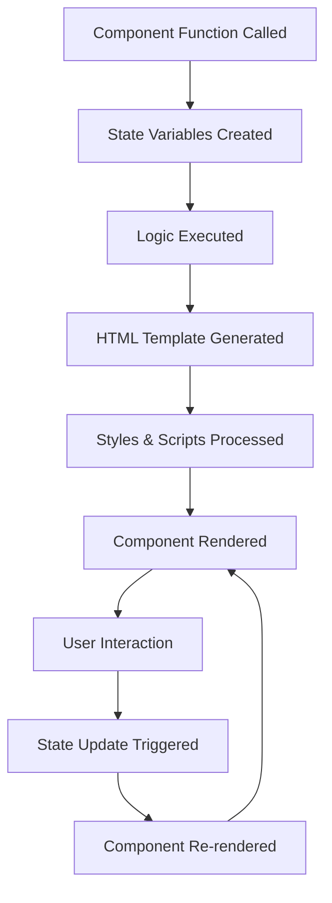

# 🧩 Components - The Heart of phpSPA

Components are **the core building blocks** of phpSPA applications. Think of them as **React components, but written in pure PHP** — reusable, composable functions that return HTML and encapsulate both logic and presentation.

!!! success "Component Philosophy"
    
    **"Everything is a component"** — from simple buttons to complex dashboards, phpSPA applications are built by composing small, focused components into larger, more capable ones.

---

## 🎯 What Are Components?

Components in phpSPA are **PHP functions** that return HTML. They can:

- **Accept parameters** (props) like any PHP function
- **Manage local state** using `createState()`
- **Include scoped styles** and JavaScript
- **Compose other components** for complex UIs
- **Handle events** and user interactions

### Component Anatomy

```php
function MyComponent($title = "Default Title") {
    // 1. State management
    $count = createState('counter', 0);
    
    // 2. Logic and data processing
    $message = $count > 5 ? "High count!" : "Keep clicking";
    
    // 3. Return HTML template
    return <<<HTML
        <div class="my-component">
            <h2>{$title}</h2>
            <p>Count: {$count}</p>
            <p>{$message}</p>
            <button onclick="increment()">Click Me</button>
        </div>
        
        <!-- Scoped styles -->
        <style data-type="phpspa/css">
            .my-component {
                padding: 1rem;
                border: 1px solid #ddd;
                border-radius: 0.5rem;
            }
        </style>
        
        <!-- Scoped JavaScript -->
        <script data-type="phpspa/script">
            function increment() {
                phpspa.setState('counter', {$count} + 1);
            }
        </script>
    HTML;
}
```

---

## 🔍 Component Types

phpSPA supports multiple component patterns to fit different use cases:

<div class="grid cards" markdown>

-   **📝 Function Components**
    
    ---
    
    Simple PHP functions that return HTML. Perfect for most use cases.
    
    ```php
    function Welcome($name) {
        return "<h1>Hello, {$name}!</h1>";
    }
    ```

-   **🏗️ Class Components**
    
    ---
    
    Object-oriented components with `__render()` method. Great for complex logic.
    
    ```php
    class Dashboard {
        public function __render() {
            return "<div>Dashboard content</div>";
        }
    }
    ```

-   **🏷️ HTML Tag Components**
    
    ---
    
    Components callable directly in HTML using `<Component.Name />` syntax.
    
    ```html
    <Component.Link to="/home" label="Home" />
    <Component.Csrf name="form1" />
    ```

-   **🔧 Built-in Components**
    
    ---
    
    Pre-built components for common functionality like navigation and security.
    
    ```php
    // Available out of the box
    <Component.Link />
    <Component.Navigate />
    <Component.Csrf />
    ```

</div>

---

## ⚡ Component Features

### 1. **Props & Parameters**

Components accept parameters just like any PHP function:

```php
function UserCard($user, $showEmail = false, $className = '') {
    $emailSection = $showEmail ? "<p>Email: {$user['email']}</p>" : '';
    
    return <<<HTML
        <div class="user-card {$className}">
            <h3>{$user['name']}</h3>
            <p>Role: {$user['role']}</p>
            {$emailSection}
        </div>
    HTML;
}

// Usage
$user = ['name' => 'John Doe', 'role' => 'Developer', 'email' => 'john@example.com'];
echo UserCard($user, true, 'highlighted');
```

### 2. **State Management**

Components can create and manage reactive state:

```php
function Counter($initialValue = 0) {
    // Create reactive state
    $count = createState('counter', $initialValue);
    
    // State automatically triggers re-renders when changed
    return <<<HTML
        <div class="counter">
            <h2>Count: {$count}</h2>
            <button onclick="phpspa.setState('counter', {$count} + 1)">
                Increment
            </button>
            <button onclick="phpspa.setState('counter', {$count} - 1)">
                Decrement
            </button>
            <button onclick="phpspa.setState('counter', {$initialValue})">
                Reset
            </button>
        </div>
    HTML;
}
```

### 3. **Scoped Styles**

Components can include their own CSS that only applies to that component:

```php
function StyledButton($text, $variant = 'primary') {
    return <<<HTML
        <button class="styled-btn btn-{$variant}" onclick="handleClick()">
            {$text}
        </button>
        
        <style data-type="phpspa/css">
            .styled-btn {
                padding: 0.75rem 1.5rem;
                border: none;
                border-radius: 0.5rem;
                font-weight: 600;
                cursor: pointer;
                transition: all 0.2s ease;
            }
            
            .btn-primary {
                background: #667eea;
                color: white;
            }
            
            .btn-secondary {
                background: #6c757d;
                color: white;
            }
            
            .styled-btn:hover {
                transform: translateY(-2px);
                box-shadow: 0 4px 8px rgba(0,0,0,0.2);
            }
        </style>
        
        <script data-type="phpspa/script">
            function handleClick() {
                alert('Button clicked!');
            }
        </script>
    HTML;
}
```

### 4. **Component Composition**

Build complex UIs by composing smaller components:

```php
function ProductCard($product) {
    $priceComponent = PriceDisplay($product['price'], $product['currency']);
    $ratingComponent = StarRating($product['rating']);
    $actionsComponent = ProductActions($product['id']);
    
    return <<<HTML
        <div class="product-card">
            
            <div class="product-info">
                <h3>{$product['name']}</h3>
                <p>{$product['description']}</p>
                {$priceComponent}
                {$ratingComponent}
            </div>
            {$actionsComponent}
        </div>
    HTML;
}

function PriceDisplay($amount, $currency = 'USD') {
    $formattedAmount = number_format($amount, 2);
    return "<span class='price'>{$currency} {$formattedAmount}</span>";
}

function StarRating($rating) {
    $stars = str_repeat('⭐', floor($rating)) . str_repeat('☆', 5 - floor($rating));
    return "<div class='rating'>{$stars} ({$rating})</div>";
}

function ProductActions($productId) {
    return <<<HTML
        <div class="product-actions">
            <button onclick="addToCart({$productId})">Add to Cart</button>
            <button onclick="addToWishlist({$productId})">♡ Wishlist</button>
        </div>
    HTML;
}
```

---

## 🔄 Component Lifecycle

Understanding the component lifecycle helps you build efficient applications:



### Lifecycle Hooks

phpSPA provides several ways to hook into the component lifecycle:

```php
function LifecycleComponent() {
    // Called on every render
    $timestamp = createState('timestamp', time());
    $currentTime = date('H:i:s', $timestamp);
    
    return <<<HTML
        <div class="lifecycle-demo">
            <h2>Component Rendered At: {$currentTime}</h2>
            <button onclick="refresh()">Refresh</button>
        </div>
        
        <script data-type="phpspa/script">
            // Called when component is mounted
            console.log('Component mounted');
            
            function refresh() {
                phpspa.setState('timestamp', Math.floor(Date.now() / 1000));
            }
            
            // Cleanup can be handled here if needed
            window.addEventListener('beforeunload', function() {
                console.log('Component unmounting');
            });
        </script>
    HTML;
}
```

---

## 🎨 Advanced Component Patterns

### 1. **Higher-Order Components**

Components that take other components as parameters:

```php
function withLoading($component, $isLoading = false) {
    if ($isLoading) {
        return <<<HTML
            <div class="loading-wrapper">
                <div class="spinner">⏳ Loading...</div>
            </div>
        HTML;
    }
    
    return $component;
}

// Usage
function DataComponent() {
    $loading = createState('loading', true);
    $data = createState('data', []);
    
    $content = $loading ? '' : DataList($data);
    
    return withLoading($content, $loading);
}
```

### 2. **Render Props Pattern**

Components that accept functions as parameters:

```php
function DataFetcher($url, $renderFunction) {
    $data = createState('api_data', null);
    $loading = createState('api_loading', true);
    $error = createState('api_error', null);
    
    return $renderFunction($data, $loading, $error);
}

// Usage
function UserList() {
    return DataFetcher('/api/users', function($users, $loading, $error) {
        if ($loading) return "<div>Loading users...</div>";
        if ($error) return "<div>Error: {$error}</div>";
        
        $userItems = array_map(fn($user) => "<li>{$user['name']}</li>", $users);
        $userListHtml = implode('', $userItems);
        return "<ul>" . $userListHtml . "</ul>";
    });
}
```

### 3. **Conditional Rendering**

Smart components that render different content based on state:

```php
function ConditionalComponent($condition, $trueComponent, $falseComponent = '') {
    return $condition ? $trueComponent : $falseComponent;
}

function AuthenticatedApp() {
    $isLoggedIn = createState('authenticated', false);
    $user = createState('user', null);
    
    return ConditionalComponent(
        $isLoggedIn,
        Dashboard($user),
        LoginForm()
    );
}
```

---

## 🔧 Component Best Practices

### 1. **Single Responsibility**

Each component should have one clear purpose:

```php
// ✅ Good - Single responsibility
function UserAvatar($user, $size = 'medium') {
    $sizeClass = "avatar-{$size}";
    
    return <<<HTML
        
    HTML;
}

// ❌ Bad - Multiple responsibilities
function UserProfile($user) {
    // Handles avatar, bio, settings, posts, friends, etc.
    // This should be broken into smaller components
}
```

### 2. **Props Validation**

Validate component inputs for better reliability:

```php
function ValidatedComponent($props) {
    // Validate required props
    if (!isset($props['title'])) {
        throw new InvalidArgumentException('Title is required');
    }
    
    // Provide defaults
    $props = array_merge([
        'className' => '',
        'showBorder' => true,
        'variant' => 'default'
    ], $props);
    
    return <<<HTML
        <div class="component {$props['className']} variant-{$props['variant']}">
            <h2>{$props['title']}</h2>
        </div>
    HTML;
}
```

### 3. **Performance Optimization**

Optimize components for better performance:

```php
function OptimizedComponent($expensiveData) {
    // Cache expensive operations
    static $cache = [];
    $cacheKey = md5(serialize($expensiveData));
    
    if (!isset($cache[$cacheKey])) {
        $cache[$cacheKey] = processExpensiveData($expensiveData);
    }
    
    $processedData = $cache[$cacheKey];
    
    return <<<HTML
        <div class="optimized-component">
            {$processedData}
        </div>
    HTML;
}
```

### 4. **Error Handling**

Implement graceful error handling:

```php
function RobustComponent($data) {
    try {
        // Validate data
        if (empty($data)) {
            return "<div class='empty-state'>No data available</div>";
        }
        
        // Process data
        $content = generateContent($data);
        
        return <<<HTML
            <div class="robust-component">
                {$content}
            </div>
        HTML;
        
    } catch (Exception $e) {
        // Log error and return fallback
        error_log("Component error: " . $e->getMessage());
        
        return <<<HTML
            <div class="error-state">
                <h3>⚠️ Something went wrong</h3>
                <p>Please try again later.</p>
            </div>
        HTML;
    }
}
```

---

## 🧪 Testing Components

### Unit Testing

Test components in isolation:

```php
class ComponentTest {
    public function testUserCard() {
        $user = ['name' => 'John', 'role' => 'Developer'];
        $result = UserCard($user);
        
        $this->assertStringContains('John', $result);
        $this->assertStringContains('Developer', $result);
    }
    
    public function testUserCardWithEmail() {
        $user = ['name' => 'John', 'email' => 'john@example.com'];
        $result = UserCard($user, true);
        
        $this->assertStringContains('john@example.com', $result);
    }
}
```

### Integration Testing

Test component composition:

```php
public function testProductCardComposition() {
    $product = [
        'name' => 'Test Product',
        'price' => 29.99,
        'rating' => 4.5
    ];
    
    $result = ProductCard($product);
    
    // Check that all sub-components are included
    $this->assertStringContains('Test Product', $result);
    $this->assertStringContains('29.99', $result);
    $this->assertStringContains('⭐⭐⭐⭐', $result);
}
```

---

## 📚 Component Guidelines

!!! tip "Component Design Principles"
    
    1. **Keep it Simple**: Start with simple functions, add complexity as needed
    2. **Make it Reusable**: Design components to work in multiple contexts
    3. **Name it Well**: Use descriptive names that explain the component's purpose
    4. **Document Props**: Clearly document what parameters your component accepts
    5. **Handle Edge Cases**: Consider empty data, errors, and loading states

!!! info "State Management Tips"
    
    1. **Local State**: Use `createState()` for component-specific data
    2. **Shared State**: Use consistent state keys across related components
    3. **State Updates**: Always use `phpspa.setState()` from JavaScript
    4. **State Persistence**: Consider which state should persist across navigation

!!! success "Performance Tips"
    
    1. **Lazy Loading**: Only create expensive components when needed
    2. **Caching**: Cache results of expensive operations
    3. **Minimal DOM**: Return only the HTML that needs to be updated
    4. **Efficient State**: Don't create state for data that doesn't change

---

## 🚀 Next Steps

Ready to dive deeper into components? Explore these advanced topics:

<div class="buttons" markdown>
[Creating Components](creating-components.md){ .md-button .md-button--primary }
[Component Structure](component-structure.md){ .md-button }
[Component Props](component-props.md){ .md-button }
[Built-in Components](built-in-components.md){ .md-button }
</div>

---

## 💡 Key Takeaways

**Components are the foundation of phpSPA applications.** They provide:

- **🧩 Modularity**: Build complex UIs from simple, focused pieces
- **🔄 Reusability**: Write once, use anywhere in your application  
- **🧠 State Integration**: Reactive data that automatically updates the UI
- **🎨 Encapsulation**: Self-contained styling and behavior
- **⚡ Performance**: Efficient rendering and updating

Master components, and you'll master phpSPA!
