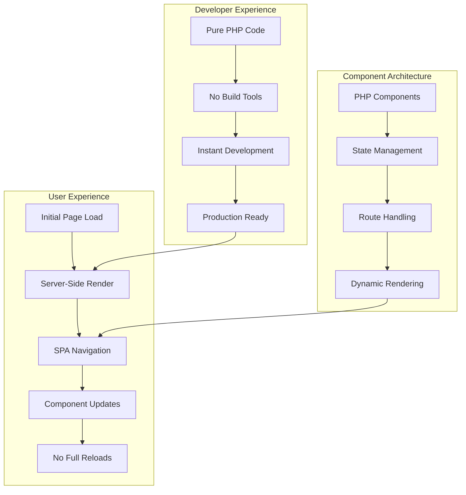

# 🧩 phpSPA - Component-Based PHP Library

<div class="hero-section" markdown>

**Build reactive, component-driven web applications with pure PHP**

**phpSPA** transforms how you build web applications by bringing **React-like component architecture** to PHP — no JavaScript frameworks, no complex build tools, just powerful PHP components that create modern, interactive user experiences.

<div class="buttons" markdown>
[Get Started :fontawesome-solid-rocket:](getting-started/index.md){ .md-button .md-button--primary }
[Quick Start :fontawesome-solid-bolt:](getting-started/quick-start.md){ .md-button }
[Examples :fontawesome-solid-code:](examples/index.md){ .md-button }
</div>

</div>

---

## ✨ Why phpSPA?

<div class="grid cards" markdown>

-   :material-lightning-bolt: **⚡ Instant Performance**

    ---

    **Zero full-page reloads** with SPA-like navigation. Your app feels lightning-fast out of the box with built-in optimization and compression.

-   :material-puzzle: **🧩 Component Architecture**

    ---

    **React-inspired components** written in pure PHP. Build reusable, maintainable pieces that scale with your application.

-   :material-brain: **🧠 Smart State Management**

    ---

    **Reactive state updates** that automatically re-render components. No complex state libraries — just simple, powerful PHP functions.

-   :material-shield-check: **🛡️ Production Ready**

    ---

    **Enterprise-grade security** with built-in CSRF protection, input validation, and secure-by-default configurations.

-   :material-code-tags: **💻 Pure PHP**

    ---

    **Stay in your comfort zone**. Use your existing PHP knowledge without learning new syntaxes or complex JavaScript frameworks.

-   :material-rocket: **🚀 Zero Configuration**

    ---

    **Works out of the box** with sensible defaults. No webpack, no build steps — just include and start building.

</div>

---

## 🎯 Perfect For

<div class="feature-comparison" markdown>

| **You Need** | **Traditional Approach** | **phpSPA Solution** |
|--------------|-------------------------|---------------------|
| **Interactive UI** | Complex JavaScript + AJAX | :material-check: Simple PHP components |
| **Fast Navigation** | Full page reloads | :material-check: Instant SPA transitions |
| **State Management** | Sessions + complex logic | :material-check: Built-in reactive state |
| **SEO & Performance** | Server-side only | :material-check: SSR + SPA benefits |
| **Maintainable Code** | Mixed PHP/JS codebases | :material-check: Pure PHP architecture |
| **Team Productivity** | Split frontend/backend teams | :material-check: Full-stack PHP developers |

</div>

---

## 🏗️ How It Works

<div class="architecture-flow" markdown>



</div>

**The Magic Behind phpSPA:**

1. **🏗️ Component-First**: Build your UI as reusable PHP functions that return HTML
2. **🧠 Reactive State**: Create state variables that automatically trigger re-renders
3. **🧭 Smart Routing**: Handle URLs and navigation with simple, declarative routes
4. **⚡ Dynamic Updates**: Only update the parts of your page that changed
5. **🔧 Zero Config**: Everything works perfectly with sensible defaults

---

## 🚀 Quick Taste

See how easy it is to build interactive components:

=== "Counter Component"

    ```php title="components/Counter.php"
    <?php
    use function phpSPA\Component\createState;

    function Counter() {
        $count = createState('counter', 0);
        
        return <<<HTML
            <div class="counter">
                <h2>Count: {$count}</h2>
                <button onclick="phpspa.setState('counter', {$count} + 1)">
                    Increment
                </button>
                <button onclick="phpspa.setState('counter', 0)">
                    Reset
                </button>
            </div>
        HTML;
    }
    ```

=== "Todo List Component"

    ```php title="components/TodoList.php"
    <?php
    use function phpSPA\Component\createState;

    function TodoList() {
        $todos = createState('todos', ['Learn phpSPA', 'Build amazing apps']);
        $newTodo = createState('newTodo', '');
        
        $todoItems = implode('', array_map(fn($todo) => 
            "<li>{$todo}</li>", $todos
        ));
        
        return <<<HTML
            <div class="todo-app">
                <h2>My Todos</h2>
                <ul>{$todoItems}</ul>
                <input 
                    value="{$newTodo}" 
                    placeholder="Add new todo..."
                    onchange="phpspa.setState('newTodo', this.value)"
                >
                <button onclick="addTodo()">Add Todo</button>
                
                <script data-type="phpspa/script">
                    function addTodo() {
                        const newTodo = phpspa.getState('newTodo');
                        if (newTodo.trim()) {
                            const todos = phpspa.getState('todos');
                            phpspa.setState('todos', [...todos, newTodo]);
                            phpspa.setState('newTodo', '');
                        }
                    }
                </script>
            </div>
        HTML;
    }
    ```

=== "Navigation Setup"

    ```php title="index.php"
    <?php
    require 'vendor/autoload.php';
    
    use phpSPA\App;
    use phpSPA\Component;
    
    // Create app with method chaining
    $app = (new App(require 'Layout.php'))
        ->attach(
            (new Component('Counter'))
                ->route('/')
                ->title('Counter Demo')
        )
        ->attach(
            (new Component('TodoList'))
                ->route('/todos')
                ->title('Todo List')
        )
        ->defaultTargetID('app')
        ->compression('auto')
        ->cors()
        ->run();
    ```

---

## 🎨 Rich Feature Set

<div class="feature-grid" markdown>

### 🧩 Component System
- **Function Components**: Simple PHP functions that return HTML
- **Class Components**: Object-oriented components with `__render()` method
- **Nested Components**: Build complex UIs with component composition
- **Props & Data Flow**: Pass data between components seamlessly

### 🧭 Advanced Routing
- **Dynamic Routes**: `/user/{id}`, `/post/{slug}` with parameter extraction
- **HTTP Methods**: Handle GET, POST, PUT, DELETE with the same component
- **Route Patterns**: Flexible pattern matching with type validation
- **Navigation Components**: Built-in `<Component.Link />` and `<Component.Navigate />`

### 🧠 Powerful State
- **Reactive State**: `createState('key', defaultValue)` with auto re-rendering
- **State Mapping**: Transform arrays into HTML with `$state->map()`
- **Loading States**: Built-in loading indicators and async handling
- **Cross-Component State**: Share state between different components

### ⚡ Performance Features
- **HTML Compression**: Multi-level compression with JS/CSS minification
- **Auto-Optimization**: Environment-based optimization (dev/staging/prod)
- **Gzip Support**: Automatic compression when supported
- **Lazy Loading**: Load components only when needed

### 🛡️ Security First
- **CSRF Protection**: `<Component.Csrf />` with automatic token management
- **Input Validation**: Built-in request handling and sanitization
- **Secure Defaults**: Production-ready security out of the box
- **Type Safety**: Parameter type validation and casting

### 🔧 Developer Experience
- **Method Chaining**: Fluent API for cleaner code
- **Auto-Reload**: Real-time component updates during development
- **Error Handling**: Comprehensive error routes and debugging
- **Framework Integration**: Works with Laravel, Symfony, CodeIgniter

</div>

---

## 🌟 What Makes phpSPA Special

!!! success "The React Experience in PHP"

    phpSPA brings the **component-driven development** you love from React, but keeps you in the **PHP ecosystem** you know and trust.

!!! info "No Learning Curve"

    If you know PHP and HTML, you already know phpSPA. **No new syntax**, no complex concepts — just enhanced PHP with modern capabilities.

!!! tip "Production Performance"

    Built for **enterprise applications** with automatic optimization, compression, and security features that make your apps blazing fast.

!!! note "Framework Agnostic"

    Use phpSPA with **any PHP setup** — plain PHP, Laravel, Symfony, or any framework. It adapts to your existing codebase.

---

## 📦 Installation

Get started in under 30 seconds:

=== "Composer (Recommended)"

    ```bash
    composer require dconco/phpspa
    ```

    ```php
    <?php
    require 'vendor/autoload.php';
    
    use phpSPA\App;
    use phpSPA\Component;
    // Ready to build!
    ```

=== "Quick Template"

    ```bash
    git clone https://github.com/mrepol742/phpspa-example my-app
    cd my-app
    composer install
    composer start
    ```

=== "CDN Integration"

    ```html
    <!-- Include the JavaScript engine -->
    <script src="https://unpkg.com/phpspa-js"></script>
    ```

---

## 🎓 Learning Path

<div class="learning-path" markdown>

**New to phpSPA?** Follow this recommended learning path:

1. **[📚 Getting Started](getting-started/index.md)** — Core concepts and setup
2. **[🧩 Component Basics](components/index.md)** — Building your first components  
3. **[🧭 Routing System](routing/index.md)** — URL handling and navigation
4. **[🧠 State Management](state/index.md)** — Reactive state and updates
5. **[⚡ Performance](performance/index.md)** — Optimization and production tips
6. **[🛡️ Security](security/index.md)** — Protecting your application
7. **[📚 Examples](examples/index.md)** — Real-world patterns and recipes

</div>

---

## 🌍 Community & Support

<div class="community-grid" markdown>

-   **📚 Documentation**
    
    Comprehensive guides, API reference, and examples

-   **💬 Discord Community**
    
    Get help, share projects, and connect with other developers

-   **🐛 GitHub Issues**
    
    Report bugs, request features, and contribute

-   **🎥 Video Tutorials**
    
    Learn with step-by-step video guides

</div>

---

## ⭐ Support the Project

If phpSPA helps you build amazing applications, consider:

- :star: **[Star us on GitHub](https://github.com/dconco/phpspa)**
- :fontawesome-brands-twitter: **[Share on Twitter](https://twitter.com/intent/tweet?text=Check%20out%20phpSPA%20-%20Component-based%20PHP%20library%20for%20modern%20web%20apps!&url=https://phpspa.readthedocs.io)**
- :material-bug: **[Report issues](https://github.com/dconco/phpspa/issues)**
- :material-heart: **[Sponsor development](https://github.com/sponsors/dconco)**

---

<div class="creator-section" markdown>

## 👨‍💻 Created by Dave Conco

**phpSPA** is crafted with ❤️ by [Dave Conco](https://github.com/dconco) — a developer who believes in the **power of simplicity** and the **elegance of PHP**.

**"Why make web development complex when it can be beautifully simple?"**

<div class="creator-links" markdown>
[:fontawesome-brands-github: GitHub](https://github.com/dconco){ .md-button }
[:fontawesome-brands-twitter: Twitter](https://twitter.com/dave_conco){ .md-button }
[:material-web: Portfolio](https://dconco.github.io){ .md-button }
</div>

</div>

---

<div class="cta-section" markdown>

## 🚀 Ready to Build Amazing Apps?

**Start your phpSPA journey today and experience the future of PHP web development.**

[Get Started Now :material-rocket-launch:](getting-started/index.md){ .md-button .md-button--primary .md-button--large }
[View Examples :material-code-braces:](examples/index.md){ .md-button .md-button--large }

</div>

---

**Latest Version:** v1.1.5 | **License:** MIT | **PHP:** 8.2+
