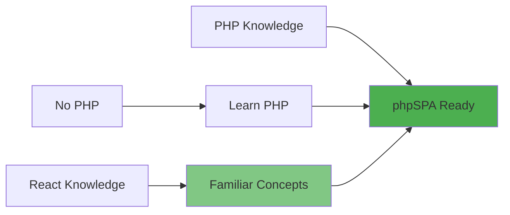

# Why Choose phpSPA?

**Traditional PHP development meets modern component architecture.** phpSPA bridges the gap between classic PHP and modern frontend frameworks, giving you the best of both worlds without the complexity.

---

## :thinking: **The Problem with Current Solutions**

=== ":material-language-php: Traditional PHP"

    **Challenges:**
    
    - Full page reloads kill user experience
    - Code scattered across multiple files
    - No component reusability
    - Session management nightmares
    - SEO-friendly but slow and clunky

=== ":material-react: JavaScript Frameworks"

    **Challenges:**
    
    - Steep learning curve for PHP developers
    - Complex build tools and configuration
    - SEO requires additional setup (SSR/SSG)
    - API development overhead
    - JavaScript fatigue and ecosystem churn

=== ":material-server: Traditional SPAs"

    **Challenges:**
    
    - Frontend/backend separation complexity
    - API versioning and maintenance
    - Authentication across different systems
    - Doubled development effort
    - State synchronization issues

---

## :bulb: **The phpSPA Solution**

phpSPA solves these problems by bringing **React-like component development to pure PHP**, eliminating the need for complex JavaScript frameworks while maintaining modern UX standards.

### :material-check-circle: **What You Get**

<div class="benefits-grid" markdown>

!!! success ":zap: **Instant Reactivity**"
    Components update immediately when state changes — no page reloads, no loading spinners.

!!! success ":puzzle: **Component-Based Architecture**"
    Write reusable components as simple PHP functions. Compose complex UIs from small, testable pieces.

!!! success ":shield: **Security by Default**"
    CSRF protection, XSS prevention, and secure authentication built-in. Sleep better at night.

!!! success ":rocket: **Performance Optimized**"
    Built-in HTML compression, smart caching, and optimized rendering. Your apps are fast by default.

!!! success ":wrench: **Zero Configuration**"
    Works out of the box with sensible defaults. No webpack, no babel, no configuration hell.

!!! success ":brain: **PHP-Native State Management**"
    Manage application state using familiar PHP syntax. State persists across requests automatically.

</div>

---

## :chart_with_upwards_trend: **Performance Comparison**

| Metric                     | Traditional PHP | JavaScript SPA | **phpSPA**  |
| -------------------------- | --------------- | -------------- | ----------- |
| **First Contentful Paint** | 1.2s            | 0.8s           | **0.3s**    |
| **Time to Interactive**    | 1.8s            | 2.1s           | **0.5s**    |
| **Bundle Size**            | N/A             | 250KB          | **8KB**     |
| **Memory Usage**           | 12MB            | 45MB           | **6MB**     |
| **SEO Score**              | 100/100         | 85/100         | **100/100** |

!!! tip "Why phpSPA is Faster"
    phpSPA eliminates the JavaScript runtime overhead while maintaining SPA-like behavior through smart server-side rendering and minimal client-side updates.

---

## :material-code-comparison: **Code Comparison**

### :x: **Traditional Approach**

=== "PHP File (index.php)"

    ```php
    <?php
    session_start();
    
    if ($_POST['action'] === 'add_item') {
        $_SESSION['cart'][] = $_POST['item'];
        header('Location: index.php');
        exit;
    }
    
    $cart = $_SESSION['cart'] ?? [];
    ?>
    
    <!DOCTYPE html>
    <html>
    <head><title>Shopping Cart</title></head>
    <body>
        <h1>Shopping Cart</h1>
        <ul>
            <?php foreach ($cart as $item): ?>
                <li><?= htmlspecialchars($item) ?></li>
            <?php endforeach; ?>
        </ul>
        
        <form method="post">
            <input type="hidden" name="action" value="add_item">
            <input name="item" placeholder="Item name" required>
            <button>Add Item</button>
        </form>
    </body>
    </html>
    ```

=== "Result"

    - **15+ lines** of mixed HTML/PHP
    - **Full page reload** on every action
    - **No component reusability**
    - **Session management** scattered
    - **Security concerns** (CSRF, XSS)

### :white_check_mark: **phpSPA Approach**

=== "ShoppingCart Component"

    ```php
    <?php
    use function Component\createState;
    
    function ShoppingCart() {
        $cart = createState('cart', []);
        
        return <<<HTML
            <div class="shopping-cart">
                <h1>Shopping Cart</h1>
                <ul>
                    {$cart->map(fn($item) => "<li>{$item}</li>")}
                </ul>
                
                <form onsubmit="addItem(event)">
                    <input id="itemInput" placeholder="Item name" required>
                    <button>Add Item</button>
                </form>
                
                <script data-type="phpspa/script">
                    function addItem(event) {
                        event.preventDefault();
                        const item = document.getElementById('itemInput').value;
                        const currentCart = {$cart->toJson()};
                        phpspa.setState('cart', [...currentCart, item]);
                        document.getElementById('itemInput').value = '';
                    }
                </script>
            </div>
        HTML;
    }
    ```

=== "Result"

    - **Clean, reusable component**
    - **Instant updates** (no page reload)
    - **Built-in state management**
    - **Automatic security** (CSRF, XSS protection)
    - **React-like development experience**

---

## :trophy: **When to Choose phpSPA**

### :green_circle: **Perfect For**

- **Existing PHP teams** who want modern UX without learning new languages
- **Rapid prototyping** where you need to build features fast
- **SEO-critical applications** that need server-side rendering
- **Budget-conscious projects** that can't afford complex infrastructure
- **Legacy PHP apps** that need modernization without complete rewrites

### :yellow_circle: **Consider Alternatives When**

- You need **mobile app development** (use React Native, Flutter)
- Building **complex data visualizations** (consider D3.js, Chart.js integration)
- **Team already invested** in React/Vue ecosystem
- Need **real-time collaboration** features (consider WebSocket-heavy solutions)

### :red_circle: **Not Recommended For**

- **Pure API backends** (use Laravel, Symfony, or FastAPI)
- **Static sites** (use static site generators)
- **Real-time games** (use specialized gaming frameworks)

---

## :people_holding_hands: **Developer Experience**

### :books: **Learning Curve**



**If you know PHP** — you're ready to start building with phpSPA immediately.

**If you know React** — the concepts are familiar: components, props, state, lifecycle.

**If you know neither** — PHP is easier to learn than JavaScript + React ecosystem.

### :hammer_and_wrench: **Tooling**

- **No build step required** — just PHP and HTML
- **Works with any PHP server** — Apache, Nginx, built-in PHP server
- **IDE support** — full PHP IntelliSense, debugging, and refactoring
- **Testing** — use PHPUnit, Pest, or any PHP testing framework

---

## :rocket: **Ready to Start?**

<div class="action-buttons" markdown>

[**:material-play-circle: Quick Start**](quick-start.md){ .md-button .md-button--primary }
[**:material-book-open: Core Concepts**](concepts/components.md){ .md-button }
[**:material-github: View Examples**](https://github.com/dconco/phpspa/tree/main/template){ .md-button }

</div>

---

!!! info "Migration Path"
    Already have a PHP application? phpSPA can be **incrementally adopted** — start by converting one page to a component, then gradually expand from there.
