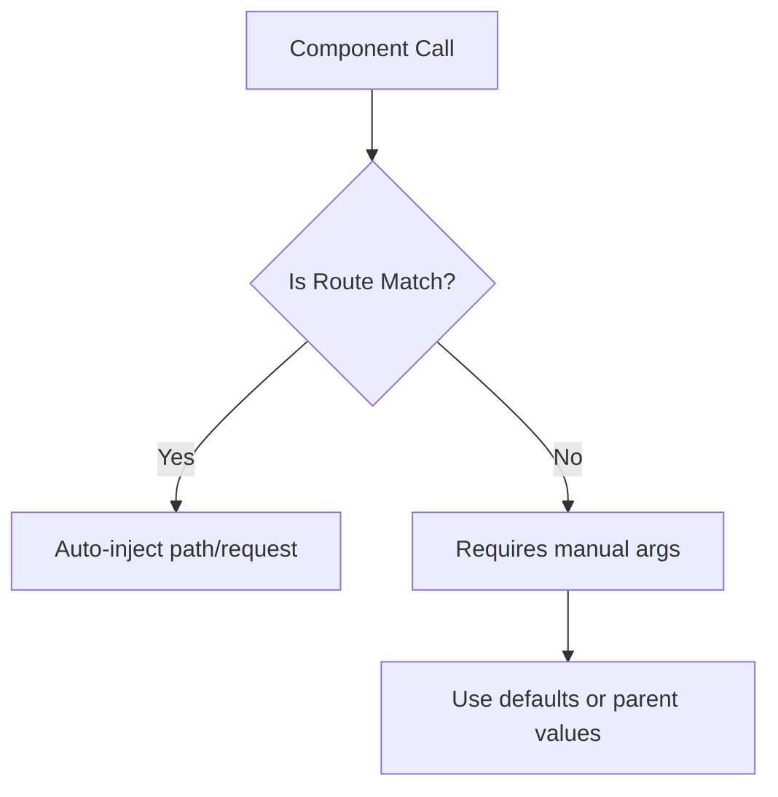

# 🧬 Component Props (Passing Data to Components)

!!! abstract "Core Principle"
    Since phpSPA components are PHP functions, props work exactly like function arguments - with some smart conventions for routing.

---

## ✅ Basic Usage

```php title="Component with props"
<?php
function Admin(string $name, int $age, array $path = []) {
    return "<h1>$name - $age</h1>";
}
```

```php title="Using the component"
<?php
function Dashboard(array $path) {
    return Admin(name: "dconco", age: 10, path: $path);
}
```

!!! tip "Key Notes"
    - 🔹 **Named arguments** must match parameter names exactly
    - 🔹 `path` is optional but enables route-aware components
    - 🔹 Type hints (`string`, `int`) provide built-in validation

---

## ⚙️ Special Props Handling

### The `$path` Parameter

```php title="Route-matched vs manual usage"
// Automatically populated when matched via route:
// e.g., /admin/{name}/{age}

// Manual usage requires either:
function Admin(string $name, array $path = []) { ... }  // Default
// OR
Admin(name: "dconco", path: $parentPath);  // Explicit pass
```

### The `$request` Object

```php title="Request handling best practice"
<?php
use phpSPA\Http\Request;

function Search(
    string $query, 
    array $path = [],
    Request $request = new Request()  // Always default!
) {
    $page = $request('page', 1);
    return "Showing page $page for '$query'";
}
```

!!! warning "Critical"
    Always provide default `Request` objects - components should work both in routes and when manually composed.

---

## 📊 Prop Rules Reference

| Prop Type        | Injection Source | Required Default? | Usage Context           |
| ---------------- | ---------------- | ----------------- | ----------------------- |
| Custom (`$name`) | Manual passing   | No                | Always explicit         |
| `$path`          | Route matcher    | Yes if reused     | Route parameters access |
| `$request`       | Auto-injected    | Always            | Query params, POST data |



---

## 🏗 Practical Patterns

### Prop Forwarding

```php title="Passing all props to child"
<?php
function UserProfile(array $props) {
    return ProfileCard(...$props);
}
```

### Validation Layer

```php title="Type-safe props"
<?php
function StrictComponent(
    string $id,
    int $count = 0,
    array $allowed = ['read']
) {
    // Built-in type checking
}
```

➡️ **Next Up**: [Route Case Sensitivity :material-arrow-right:](./12-route-case-sensitivity.md){ .md-button .md-button--primary }
