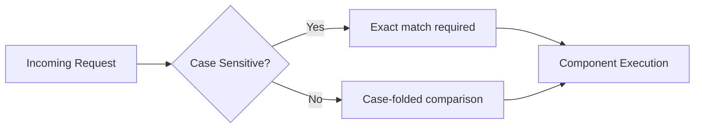

# 🔡 Route Case Sensitivity

!!! gears "Default Behavior"
    phpSPA routes are **case-insensitive by default** — `/Login` and `/login` resolve to the same component.

---

## 🎚 Granular Control

### 🌍 Global Configuration

```php title="Setting default for all routes"
// Make ALL routes case-sensitive by default:
$app->defaultToCaseSensitive();

// Revert to default case-insensitive behavior:
$app->defaultToCaseInsensitive(); 
```

### 🔧 Per-Component Overrides

```php title="Individual component settings"
<?php
$adminComponent = new Component('Admin');

// Force exact case matching:
$adminComponent->caseSensitive();  

// Explicitly allow case variations (default):
$guestComponent->caseInsensitive();  
```

!!! tip "When to Override"
    - Banking apps needing `/Transfer` ≠ `/transfer`
    - Legacy systems preserving exact URLs
    - Marketing pages where UX trumps precision

---

## 🕵️‍♂️ Real-World Scenario

```php title="Mixed sensitivity in one app"
<?php
// Strict admin access (exact case required)
$secureAdmin = new Component('AdminPanel');
$secureAdmin->route("/AdminConsole");
$secureAdmin->caseSensitive();

// Public-facing content (flexible casing)
$publicDocs = new Component('Documentation');
$publicDocs->route("/docs"); 
// caseInsensitive() is default, but can be explicit
```



---

## 🚦 Best Practices

| Use Case            | Recommendation      | Example            |
| ------------------- | ------------------- | ------------------ |
| Security-sensitive  | `caseSensitive()`   | `/Admin/Export`    |
| User-facing content | `caseInsensitive()` | `/About/Company`   |
| API endpoints       | Match your API spec | `/api/v1/resource` |

!!! warning "Consistency Matters"
    - Document your casing strategy
    - Avoid mixing styles for similar routes
    - Consider SEO implications for public pages

---

➡️ **Next Up**: [Setting Page Titles :material-arrow-right:](./13-setting-page-titles.md){ .md-button .md-button--primary }
