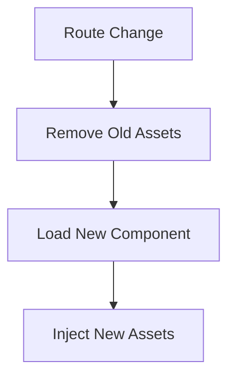

# 🎯 Per-Component Scripts and Styles in PHP

!!! abstract "Component-Specific Assets"
    phpSPA allows you to attach custom JavaScript and CSS styles **directly from your PHP components**, which get injected automatically during rendering.

---

## 🧠 Why Use This?

!!! question ""
    Because phpSPA swaps components dynamically during route changes, you may want certain assets to load **only when their component is active**.

phpSPA provides these methods:

- `$component->script()` for JavaScript
- `$component->styleSheet()` for CSS

---

## 🧾 Add JavaScript with `$component->script()`

```php title="Adding component script"
<?php
$comp->script(fn() => <<<JS
    console.log("Dashboard component loaded");

    document.getElementById("refresh").addEventListener("click", () => {
        phpspa.reload();
    });
JS);
```

!!! note "Behavior"
    - Scripts execute when component renders
    - Multiple scripts append in definition order
    - Scoped to component lifetime

---

## 🎨 Add Styles with `$component->styleSheet()`

```php title="Adding component CSS"
<?php

$comp->styleSheet(fn() => <<<CSS
    .dashboard-title {
        font-size: 24px;
        font-weight: bold;
    }

    #refresh {
        margin-top: 10px;
    }
CSS);
```

!!! tip "Style Scoping"
    Styles are automatically removed when navigating away from the component.

---

## ✨ Complete Example

```php title="Dashboard Component"
<?php
$dashboard = new Component("Dashboard");

$dashboard->route("/dashboard");
$dashboard->title("Dashboard");

$dashboard->styleSheet(fn() => <<<CSS
    body {
        background-color: #f5f5f5;
    }
CSS);

$dashboard->script(fn() => <<<JS
    console.log("Welcome to the dashboard!");
JS);
```

---

## 🔍 Implementation Details

!!! gears "Behind the Scenes"
    phpSPA processes and outputs assets as:

    ```html
    <style data-type="phpspa/css">/* component CSS */</style>
    <script data-type="phpspa/script">/* component JS */</script>
    ```

    The frontend (`phpspa-js`) handles asset management during navigation.

---



➡️ **Next Up**: [Handling Loading State :material-arrow-right:](./19-handling-loading-states.md){ .md-button .md-button--primary }
